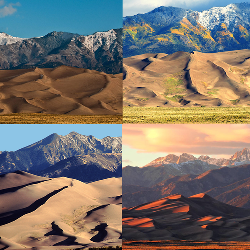
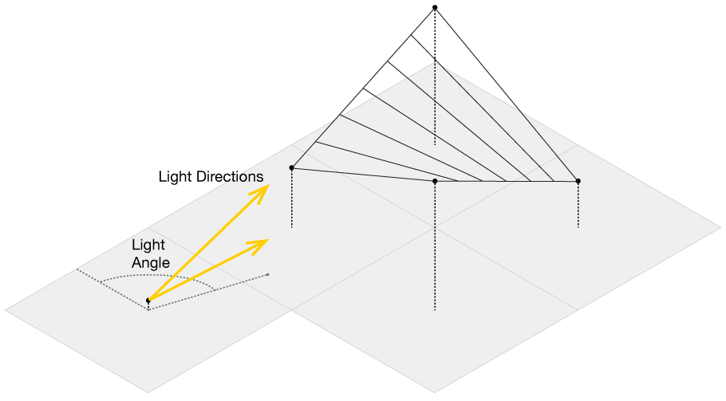
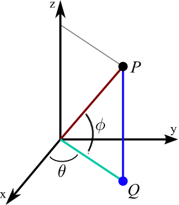
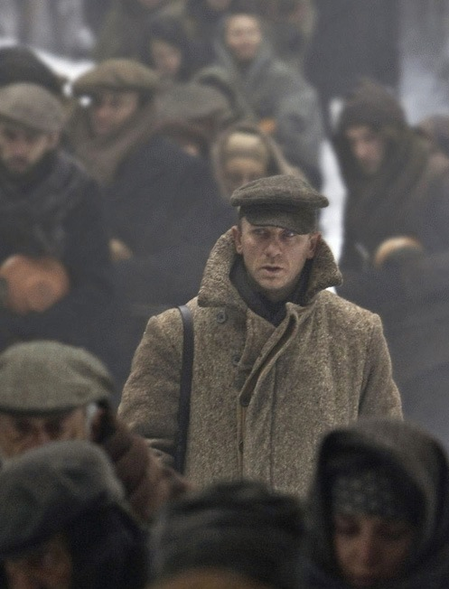

 ---
title: "PennMUSA"
author: "Tyler Morgan-Wall"
date: "9/14/2019"
output: html_document
editor_options: 
  chunk_output_type: console
---

```{r setup, include=FALSE}
knitr::opts_chunk$set(echo = TRUE, cache = TRUE, fig.width = 7, fig.height = 7, fig.align = "center", dpi = 143)
```

#UPenn Masterclass: 3D Mapping and Visualization with R and Rayshader

Tyler Morgan-Wall (@tylermorganwall), Institute for Defense Analyses

Personal website: https://www.tylermw.com

Rayshader website: https://www.rayshader.com

Github: https://www.github.com/tylermorganwall

```{r, warning=FALSE, message=FALSE}
# install.packages("whitebox", repos="http://R-Forge.R-project.org")
remotes::install_github("giswqs/whiteboxR")
whitebox::wbt_init()
library(ggplot2)
library(whitebox)
library(rayshader)
library(geoviz)
library(raster)
library(spatstat)
library(spatstat.utils)
library(suncalc)
library(sp)
library(lubridate)
setwd("~/Desktop/musa/")

```

# Hillshading with Rayshader

We're going to start by demoing how digital elevation models (DEMs) have traditionally been displayed. Here, we load in a DEM of the River Derwent in Hobart, Tasmania. We'll plot it using both the image and plot functions to see how elevation data is traditionally displayed--mapping elevation directly to color.

Let's take a raster object and extract a bare R matrix to work with rayshader. To convert the data from the raster format to a bare matrix, we will use the rayshader function `raster_to_matrix()`.  We will first visualize the data with the base R `image()` function.

```{r fig.width = 5, fig.height = 5}

loadzip = tempfile() 
download.file("https://tylermw.com/data/dem_01.tif.zip", loadzip)
hobart_tif = raster::raster(unzip(loadzip, "dem_01.tif"))
unlink(loadzip)

hobart_mat = raster_to_matrix(hobart_tif)
unlink("dem_01.tif")

image(hobart_mat)

```

The `image()` function orients data differently than it is in reality--the image is flipped vertically. Let's use rayshader's `height_shade()` function, which performs the same mapping but orients the resulting map correctly. Here, the default uses `terrain.colors()` instead of the yellow-to-red mapping.

```{r fig.width = 5, fig.height = 5}

hobart_mat %>%
  height_shade() %>%
  plot_map()

```

Where in nature does color map to elevation? Usually, you get this kind of mapping on large scale topographic features, such as a tree line on a mountain. Here's a nice illustration o from the 1848 book by Alexander Keith Johnston showing that elevation-to-color mapping:


On smaller scale (more human-sized) features like hills or dunes, the color is dominated by instead by lighting and how the sun hits the surface. The surfaces aren't colored by elevation--rather, their colors is largely determined by the angle the surface along with the direction of the light.

Note the (sometimes drastic) change in surface color when the lighting changes:



Rather than color by elevation, let's try coloring the surface by the direction the slope is facing and the steepness of that slope. This is implemented in the rayshader function, `sphere_shade()`. Here's a video explanation of how it works:

<br>
<video controls>
  <source src="https://www.tylermw.com/wp-content/uploads/2018/06/fullcombined_web.mp4" type="video/mp4">
</video>
<br>

We'll take this and plug it into the `sphere_shade()` function, which performs this mapping of surface direction and slope to color.

```{r fig.width = 5, fig.height = 5}

#Example of data stored in hobart_mat object:
hobart_mat[1:10,1:10]

hobart_mat %>%
  sphere_shade() %>%
  plot_map()

```

We note right away that it's much more apparent in this image that there is a body of water (the River Derwent) in the middle of this image, weaving between the two mountains. While this feature wasn't apparent in the more tradition height-to-color mapping, it becomes immediately visible when we color by slope.

In fact, rayshader includes two functions, `detect_water()` and `add_water()`, that allow you to detect and add bodies of water directly to the hillshade via the elevation data. This works by looking for large, relatively flat, connected regions in a DEM. Usually, large extremely flat areas are water, but occasionally these functions can result in false positives. `detect_water()` provides the parameters `min_area` and `cutoff` in `detect_water()` so the user can try to . `min_area` specifies the minimum number of connected flat points that constitute a body of water. `cutoff` determines how vertical a surface as to be to be defined as flat: `cutoff = 1.0` only accepts areas pointing straight up as flat, while `cutoff = 0.99` allows for areas that are slightly less than flat to be classified as water. The default is `cutoff = 0.999`.

```{r fig.width = 5, fig.height = 5}

hobart_mat %>%
  sphere_shade() %>%
  add_water(detect_water(hobart_mat, min_area = 10), color="blue") %>%
  plot_map()

```

If increase the minimum required area to be classified as water, we will fix the flat areas at the top of the map that are being erroneously catagorized as water.

```{r fig.width = 5, fig.height = 5}

hobart_mat %>%
  sphere_shade() %>%
  add_water(detect_water(hobart_mat,  min_area = 200), color="blue") %>%
  plot_map()

```

The default is to look for flat regions 1/400th the area of the matrix. There's nothing special about this number, but it's a default that tended to work fairly well for several datasets I tested it on, but it's a parameter you can adjust to suit your dataset. Here we'll also use the default water color.

```{r fig.width = 5, fig.height = 5}

hobart_mat %>%
  sphere_shade() %>%
  add_water(detect_water(hobart_mat)) %>%
  plot_map()

```

Both `sphere_shade()` and `add_water()` come with several built-in palettes, and you can create your own with the `create_texture()` function. Here's the built-in textures (top is highlight color, and all can be specified):


And here's what a sampling of those textures look like (check the documentation for more):

```{r fig.width = 5, fig.height = 5}

hobart_mat %>%
  sphere_shade(texture = "desert") %>%
  add_water(detect_water(hobart_mat), color = "desert") %>%
  plot_map()

hobart_mat %>%
  sphere_shade(texture = "imhof4") %>%
  add_water(detect_water(hobart_mat), color = "imhof4") %>%
  plot_map()

hobart_mat %>%
  sphere_shade(texture = "bw") %>%
  add_water(detect_water(hobart_mat), color = "unicorn") %>%
  plot_map()

```

Rayshader's name comes the method it uses to calculate hillshades: raytracing, which realisticly simulates how light travels across the elevation model. Most traditional methods of hillshading only use the local angle that the surface makes with the light, and do not take into account areas that actually cast a shadow. This basic type of hillshading is sometimes referred to as "lambertian", and is implemented in the function `lamb_shade()`.

```{r fig.width = 5, fig.height = 5}

hobart_mat %>%
  lamb_shade(zscale=33) %>%
  plot_map()

```

To shade surfaces using raytracing, rayshader draws rays originating from each point towards a light source, specified using the `sunangle` and `sunaltitude` argument. The light by default has a fixed angular width the size of the sun, but the distribution can also be set in the argument `anglebreaks`. Here are two gifs showing how rayshader calculates shadows with `ray_shade`:




Let's add a layer of shadows to this map, using the `add_shadow()` and `ray_shade()` functions. We layer our shadows to our `sphere_shade()` base color layer.

```{r fig.width = 5, fig.height = 5}

hobart_mat %>%
  lamb_shade(zscale=33) %>%
  add_shadow(ray_shade(hobart_mat, zscale=33, sunaltitude = 3, lambert = FALSE), 0.3) %>%
  plot_map()

```

We can combine all these together to make our final 2D map:

```{r fig.width = 5, fig.height = 5}

hobart_mat %>%
  sphere_shade() %>%
  add_water(detect_water(hobart_mat), color="lightblue") %>%
  add_shadow(ray_shade(hobart_mat,zscale=33, sunaltitude = 3,lambert = FALSE), max_darken = 0.5) %>%
  add_shadow(lamb_shade(hobart_mat,zscale=33,sunaltitude = 3), max_darken = 0.5) %>%
  plot_map()

```

We can adjust the highlight/sun direction using the `sunangle` argument in both the `sphere_shade()` function and the `ray_shade()` function.

We'll start witht the default angle: 315 degrees, or the light from the Northwest. One question you might ask yourself:


```{r fig.width = 5, fig.height = 5}
#Default angle: 315 degrees.

hobart_mat %>%
  sphere_shade() %>%
  add_water(detect_water(hobart_mat), color="lightblue") %>%
  add_shadow(ray_shade(hobart_mat, zscale=33, sunaltitude = 5,lambert = FALSE), 
             max_darken = 0.5) %>%
  add_shadow(lamb_shade(hobart_mat,zscale=33,sunaltitude = 5), max_darken = 0.8) %>%
  plot_map()

#45 degrees

hobart_mat %>%
  sphere_shade(sunangle = 45) %>%
  add_water(detect_water(hobart_mat), color="lightblue") %>%
  add_shadow(ray_shade(hobart_mat,sunangle = 45, zscale=33, sunaltitude = 5,lambert = FALSE), 
             max_darken = 0.5) %>%
  add_shadow(lamb_shade(hobart_mat,zscale=33,sunaltitude = 5), max_darken = 0.8) %>%
  plot_map()

#135 degrees

hobart_mat %>%
  sphere_shade(sunangle = 135) %>%
  add_water(detect_water(hobart_mat), color="lightblue") %>%
  add_shadow(ray_shade(hobart_mat,sunangle = 135, zscale=33, sunaltitude = 5,lambert = FALSE), 
             max_darken = 0.5) %>%
  add_shadow(lamb_shade(hobart_mat,zscale=33,sunaltitude = 5), max_darken = 0.8) %>%
  plot_map()

#225 degrees

hobart_mat %>%
  sphere_shade(sunangle = 225) %>%
  add_water(detect_water(hobart_mat), color="lightblue") %>%
  add_shadow(ray_shade(hobart_mat,sunangle = 225, zscale=33, sunaltitude = 5,lambert = FALSE), 
             max_darken = 0.5) %>%
  add_shadow(lamb_shade(hobart_mat,zscale=33,sunaltitude = 5), max_darken = 0.8) %>%
  plot_map()

```

We can also add the effect of ambient occlusion, which in cartography is sometimes called the "sky view factor." When light travels through the atmosphere, it scatters. This scattering turns the entire sky into a light source, so when less of the sky is visible (e.g. in a valley) it's darker than when the entire sky is visible (e.g. on a mountain ridge). 

Let's calculate the ambient occlusion shadow layer for the Hobart data, and layer it onto the rest of the map.

```{r ambient_occlusion, fig.width = 5, fig.height = 5}

hobart_mat %>%
  ambient_shade() %>%
  plot_map()

hobart_mat %>%
  sphere_shade() %>%
  add_water(detect_water(hobart_mat), color="lightblue") %>%
  add_shadow(ray_shade(hobart_mat, zscale=33, sunaltitude = 5,lambert = FALSE), 
             max_darken = 0.5) %>%
  add_shadow(lamb_shade(hobart_mat,zscale=33, sunaltitude = 5), max_darken = 0.7) %>%
  plot_map()

hobart_mat %>%
  sphere_shade() %>%
  add_water(detect_water(hobart_mat), color="lightblue") %>%
  add_shadow(ray_shade(hobart_mat, zscale=33, sunaltitude = 5,lambert = FALSE), 
             max_darken = 0.5) %>%
  add_shadow(lamb_shade(hobart_mat,zscale=33, sunaltitude = 5), max_darken = 0.7) %>%
  add_shadow(ambient_shade(hobart_mat), max_darken = 0.1) %>%
  plot_map()

```

# 3D Mapping with Rayshader

Now that we know how to perform basic hillshading, we can begin the real fun part: making 3D maps. In rayshader, we do that simply by swapping out `plot_map()` with `plot_3d()`, and adding the heightmap to the function call. We don't want to re-compute the ambient_shade() call every time we replot the landscape, so lets save it to a variable.

```{r}

ambientshadows = ambient_shade(hobart_mat)

hobart_mat %>%
  sphere_shade() %>%
  add_water(detect_water(hobart_mat), color="lightblue") %>%
  add_shadow(ray_shade(hobart_mat, sunaltitude=3, zscale=33, lambert = FALSE), max_darken = 0.5) %>%
  add_shadow(lamb_shade(hobart_mat, sunaltitude=3, zscale=33), max_darken = 0.7) %>%
  add_shadow(ambientshadows, max_darken = 0.1) %>%
  plot_3d(hobart_mat, zscale=10,windowsize=c(1000,1000))

render_snapshot(clear=TRUE)

```

This opens up an `rgl` window that displays the 3D plot. Draw to manipulate the plot, and control/ctrl drag to zoom in and out. To close it, we can either close the window itself, or type in `rgl::rgl.close()`.

Just visualizing this on your screen is fun when exploring the data, but we would also like to export our figure to an image file. If you want to take a snapshot of the current view, rayshader provide the `render_snapshot()` function. If you use this without a filename, it will write and display the plot to the current device. With a filename, it will write the image to a PNG file in the local directory. For variety, let's also change the background/shadow color (arguments `background` and `shadowcolor`), depth of rendered ground/shadow (arguments `soliddepth` and `shadowdepth`), and add a title to the plot.

```{r}

hobart_mat %>%
  sphere_shade() %>%
  add_water(detect_water(hobart_mat), color="lightblue") %>%
  add_shadow(ray_shade(hobart_mat, sunaltitude=3, zscale=33, lambert = FALSE), max_darken = 0.5) %>%
  add_shadow(lamb_shade(hobart_mat, sunaltitude=3, zscale=33), max_darken = 0.7) %>%
  add_shadow(ambientshadows, max_darken = 0) %>%
  plot_3d(hobart_mat, zscale=10,windowsize=c(1000,1000), 
          phi = 40, theta = 135, zoom = 0.9, 
          background = "grey30", shadowcolor = "grey5", 
          soliddepth = -50, shadowdepth = -100)

render_snapshot(title_text = "River Derwent, Tasmania", 
                title_font = "Helvetica", 
                title_size = 50,
                title_color = "grey90")

render_snapshot(filename = "derwent.png")

#Delete the file
unlink("derwent.png")
```

If we want to programmatically change the camera, we can do so with the `render_camera()` function. We can adjust four parameters: `theta`, `phi`, `zoom`, and `fov` (field of view). Changing `theta` orbits the camera around the scene, while changing `phi` changes the angle above the horizon at which the camera is located. Here is a graphic demonstrating this relation:



`zoom` magnifies the current view (smaller numbers = larger magnification), and `fov` changes the field of view. Higher `fov` values correspond to a more pronounced perspective effect, while `fov = 0` corresponds to a orthographic camera.

Here's different views using the camera:

```{r}

render_camera(theta = 90, phi = 30, zoom = 0.7, fov = 0)
render_snapshot()

render_camera(theta = 90, phi = 30, zoom = 0.7, fov = 90)
render_snapshot()

render_camera(theta = 120, phi = 20, zoom = 0.3, fov = 90)
render_snapshot()


```

We can also use some post-processing effects to help guide our viewer through our visualization's 3D space. The easiest method of directing the viewer's attention is directly labeling the areas we'd like them to look at, using the `render_label()` function. This function takes the indices of the matrix coordinate area of interest `x` and `y`, and displays a `text` label at altitude `z`. 

```{r}

render_label(hobart_mat, "River Derwent", textcolor ="white", linecolor="white",
             x = 450, y = 260, z = 1400, textsize = 2.5, linewidth = 4, zscale = 10)
render_snapshot()

render_label(hobart_mat, "Jordan River (not that one)", textcolor ="white", linecolor="white",
             x = 450, y = 140, z = 1400, textsize = 2.5, linewidth = 4, zscale = 10, dashed = TRUE)
render_snapshot()

```

We can replace all existing text with the `clear_previous = TRUE`, or clear everything by calling `render_label(clear_previous = TRUE)` with no other arguments.

```{r}

render_camera(zoom = 0.9, phi=50, theta=-45,fov=0)
render_snapshot()

render_label(hobart_mat, "Mount Faulkner", textcolor ="white", linecolor="white",
             x = 135, y = 130, z = 2500, textsize = 2, linewidth = 3, zscale = 10, clear_previous = TRUE)
render_snapshot()

render_label(hobart_mat, "Mount Dromedary", textcolor ="white", linecolor="white",
             x = 320, y = 390, z = 1000, textsize = 2, linewidth = 3, zscale = 10)
render_snapshot()

render_label(clear_previous = TRUE)
render_snapshot()

rgl::rgl.close()

```

This is not the ony trick up our sleeve, though. Data visualization is not the first field to tackle the problem of "How do I direct a viewer's attention in 3D space, projected on a 2D screen?" Cinematographers encounter the same issue when they're filming (except when using small aperture sizes or lenses with short focal lengths). Below is a shot of Daniel Craig in the movie "Defiance": 



Even though the 3D space this shot is representing is fairly deep (with a distinct foreground, middle, and background), we know our attention is supposed to be focused on the man in the center. In large part due to the use of a shallow depth of field: the blur tells our viewers what isn't important, and what's in focus informs them where their attention should be.

We can apply this same technique in rayshader using the `render_depth()` function. This applies a depth of field effect, as if our scene was being photographed by a real camera. Let's focus in on the river in the background. The `focus` parameter should be between 0 and 1, where 1 is the background and 0 is the foreground. The range of depths will depend on our camera position--calling the function will print the range in the current view, and you can use `preview_focus = TRUE` to see exactly where the focal plane will be positioned.

```{r}

hobart_mat %>%
  sphere_shade(sunangle = 60) %>%
  add_water(detect_water(hobart_mat), color="lightblue") %>%
  add_shadow(ray_shade(hobart_mat, sunangle = 60, sunaltitude=3, zscale=33, lambert = FALSE), max_darken = 0.5) %>%
  add_shadow(lamb_shade(hobart_mat, sunangle = 60, sunaltitude=3, zscale=33), max_darken = 0.7) %>%
  add_shadow(ambientshadows, max_darken = 0.1) %>%
  plot_3d(hobart_mat, zscale=10,windowsize=c(1000,1000), 
          background = "#edfffc", shadowcolor = "#273633")

render_camera(theta = 120, phi = 20, zoom = 0.3, fov = 90)
render_depth(focus = 0.75, preview_focus = TRUE)
render_depth(focus = 0.75)
```

This effect is rather subtle, so let's increase the focal length of the camera using argument `focallength`. This will make for a shallower depth of field (increase the blurring effect in areas far from the focal plane). We can also add a  `title_*` argument like in `render_snapshot()`, and we'll use the `title_bar_color` argument to create a semi-transparent bar around our title.

```{r}

render_depth(focus = 0.75, focallength = 200, title_bar_color = "black",
             title_text = "The River Derwent, Tasmania", title_color = "white", title_size = 50)
rgl::rgl.close()

```

Rayshader can be used for more than just topographic data visualization--we can also easily visualize the intersection between land and water. Here, we'll use the built-in `montereybay` dataset, which includes both bathymetric and topographic data for Monterey Bay, California. We include a transparent water layer by setting `water = TRUE` in `plot_3d()`, and add lines showing the edges of the water by setting `waterlinecolor`.

```{r}

montereybay %>%
  sphere_shade() %>%
  plot_3d(montereybay, water=TRUE, waterlinecolor = "white",
          theta=-45, zoom=0.9, windowsize = c(1000,1000))
render_snapshot(title_text = "Monterey Bay, California", 
                title_color = "white", title_bar_color = "black")

```

By default, `plot_3d()` sets the water level at 0 (sea level), but we can change this, either by adjusting `waterdepth` in our call to `plot_3d()`, or by calling the `render_water()` function after the fact. Here we make the water slightly less transparent with the `wateralpha` argument (`wateralpha = 1` is opaque, `wateralpha = 0` is transparent).

```{r}

render_water(montereybay, zscale=50, waterdepth = -100, 
             waterlinecolor = "white", wateralpha=0.7)
render_snapshot(title_text = "Monterey Bay, California (water level: -100 meters)", 
                title_color = "white", title_bar_color = "black")


render_water(montereybay, zscale=50, waterdepth = 30, 
             waterlinecolor = "white", wateralpha=0.87)
render_snapshot(title_text = "Monterey Bay, California (water level: 30 meters)", 
                title_color = "white", title_bar_color = "black")

rgl::rgl.close()
```

Although our underlying matrix data is rectangular, we aren't limited to rectangular 3D plots. Any entry in the matrix that has a value of `NA` will be sliced out of the matrix. Here, we slice out just the bathymetric from the `montereybay` dataset. We still use the full matrix to calculate the hillshade and shadows, but pass the sliced elevation matrix to `plot_3d()`:

```{r}

mont_bathy = montereybay
mont_bathy[mont_bathy >= 0] = NA

montereybay %>%
  sphere_shade() %>%
  add_shadow(ray_shade(mont_bathy,zscale=50, sunaltitude = 15, lambert = FALSE),0.5) %>%
  plot_3d(mont_bathy, water=TRUE, waterlinecolor = "white",
          theta=-45, zoom=0.9, windowsize = c(1000,1000))

render_snapshot(title_text = "Monterey Bay Canyon", title_color = "white", title_bar_color = "black")
rgl::rgl.clear()

```

Alternatively, if we just want a more interesting base shape and we don't mind losing some data, we can have rayshader carve your dataset into either a hexagon or a circle by specifying the `baseshape` argument in `plot_3d()` (I also throw in some new background colors and shadow colors because variety is the spice of life):

```{r}

montereybay %>%
  sphere_shade() %>%
  add_shadow(ray_shade(montereybay,zscale=50,sunaltitude=15,lambert = FALSE),0.5) %>%
  plot_3d(montereybay, water=TRUE, waterlinecolor = "white", baseshape = "hex",
          theta=-45, zoom=0.7, windowsize = c(1000,1000), 
          shadowcolor = "#4e3b54", background = "#f7e8fc")

render_snapshot(title_text = "Monterey Bay Canyon, Hexagon", 
                title_color = "white", title_bar_color = "black", clear = TRUE)

montereybay %>%
  sphere_shade() %>%
  add_shadow(ray_shade(montereybay,zscale=50,sunaltitude = 15,lambert = FALSE),0.5) %>%
  plot_3d(montereybay, water=TRUE, waterlinecolor = "white", baseshape = "circle",
          theta=-45, zoom=0.7, windowsize = c(1000,1000),
          shadowcolor = "#4f3f3a", background = "#ffeae3")

render_snapshot(title_text = "Monterey Bay Canyon, Circle", 
                title_color = "white", title_bar_color = "black", clear = TRUE)

```

Taking snapshots of our map is useful, but a static visualizations isn't the ideal form to represent our 3D data. For the viewer, the depth variable has to be inferred from context, which can be ambiguous and easily misinterpreted. A far better form for our visualization is a movie/animation--we can guide our viewers on a 3D tour of our data, which can resolve many ambiguities. Rayshader makes this easy with the `render_movie()` function, which creates a movie (mp4 file) which can easily be shared on social media. You can add titles and all of the same arguments you can to `render_snapshot()`.

By default, `render_movie()` has two animations built in: a basic orbit `type = "orbit"`, an oscillating animation `type = "oscillate"`, and a zoom-in animation `type = "zoom"`. The `frames` argument is the number of frames, while the `fps` is the frames per second. The total length of the video is frames/fps. Generally, you shouldn't change from either 30 or 60 frames per second if you want to share your videos on social media. You also shouldn't make the camera move too fast or spin too quickly--fast camera movements can cause nausea.

```{r}

montereybay %>%
  sphere_shade() %>%
  plot_3d(montereybay, water=TRUE, waterlinecolor = "white",
          theta=-45, zoom=0.9, windowsize = c(600,600))

#Orbit will start with current setting of phi and theta
render_movie(filename = "montbay.mp4", title_text = 'render_movie(type = "orbit")', 
             phi=30 , theta = -45)

render_movie(filename = "montbayosc.mp4", phi=30 , theta = -90, type = "oscillate",
             title_text = 'render_movie(type = "oscillate")', title_color="black")

unlink("montbay.mp4")
unlink("montbayosc.mp4")

```

You can also set `type = "custom"` and pass in a vector of camera values to the `phi`, `theta`, `zoom`, and `fov` arguments, and each value will be treated as a single frame in our animation. Here I've also provided an "easing" function that smoothly transitions between two values, so we can zoom in and out nicely.

```{r}

ease_function = function(beginning, end, steepness = 1, length.out = 180) {
  single = (end) + (beginning - end) * 1/(1 + exp(seq(-10, 10, length.out = length.out)/(1/steepness)))
  single
}

zoom_values = c(ease_function(1,0.3), ease_function(0.3,1))

render_movie(filename = "montbaycustom.mp4", type = "custom",
             phi=30 + 15 * sin(1:360 * pi /180), theta = -45 - 1:360, zoom=zoom_values)
rgl::rgl.close()

unlink("montbaycustom.mp4")

```

If you want to do something more advanced, like vary the water depth between each frame or call `render_depth()` to create a depth of field effect in your animation, you'll need to generate the movie manually in a `for` loop. Luckily, this is fairly simple using the `av` package. Let's vary the water level from the most recent ice age minimum of -130 meters to the current sea level. We use the `av` package to combine them into a movie.

```{r}
montereybay %>%
  sphere_shade(texture = "desert") %>%
  plot_3d(montereybay, windowsize = c(600,600), 
          shadowcolor = "#222244", background = "lightblue")

render_camera(theta=-90, fov=70,phi=30,zoom=0.8)
Sys.sleep(1)

for(i in 1:60) {
  render_water(montereybay, zscale=50, waterdepth = -60 - 60 *cos(i*pi*6/180), 
               watercolor="#3333bb",waterlinecolor="white", waterlinealpha = 0.5)
  render_snapshot(filename = glue::glue("iceage{i}.png"), title_size = 30, instant_capture = TRUE,
                  title_text = glue::glue("Sea level: {round(-60 - 60 *cos(i*pi*6/180),1)} meters"))
}

av::av_encode_video(glue::glue("iceage{1:60}.png"), output = "custom_movie.mp4", 
                    framerate = 30)

rgl::rgl.close()

unlink(glue::glue("iceage{1:60}.png"))
unlink("custom_movie.mp4")

```

Finally, I'm going to show you a really cool feature I've just recently implemented: `render_highquality()`. This calls a powerful rendering engine built-in to rayshader to create a truly stunning visualization. You can control the view entirely through the 

https://maps.psiee.psu.edu/preview/map.ashx?layer=2021


```{r}

hobart_mat %>%
  sphere_shade(texture = "desert") %>%
  add_water(detect_water(hobart_mat),color="desert") %>%
  plot_3d(hobart_mat,zscale=10)
render_highquality()

rgl::rgl.close()

```

Here, we no longer need any of the shadow generating functions--the shadows are calculated 

Now that we know how to use rayshader, let's use it to create and visualize some data! Back in 2015, the New York Times Upshot had a fantastic piece by Quoctrung Bui and Jeremy White on mapping the shadows of New York City. 

https://www.nytimes.com/interactive/2016/12/21/upshot/Mapping-the-Shadows-of-New-York-City.html

They took three days in the year and mapped out how much each spot in the city spent in shadow: the winter solstice (December 21st), the summer solstice (June 21st), and the autumnal equinox (Sept 22nd). They worked with researchers at the Tandon school of Engineering at NYU to develop a raytracer to perform these calculations. This type of analysis is particularly timely with the explosion of so-called "pencil towers" in Manhattan--extremely tall, skinny skyscrapers lining Central Park and catering to the super wealthy. The question: How are these towers affecting 

We are going to perform and visualize a similar analysis for erecting a hypothetic "pencil tower" in West Philadelphia using lidar data from Pennsylvania and rayshader.

Let's start by loading some lidar data into R. Here's a link to several PDF files listing instructions on how to load data. We'll start with philly.pdf to get instructions for downloading our lidar data.

Let's walk through downloading a specific dataset:

Backup: https://www.tylermw.com/data/26849E233974N.zip

Now, let's load some lidar data into R. We'll do this using the `whitebox` package, which has several functions for manipulating and transforming lidar data, among many other useful features. Here, we're going to load our lidar dataset of Penn Park, right by the Schuylkill. Many lidar datasets are far too large to easily visualize, and are often noisy--we are going to use `whitebox` to clean the data, and turn it into a simple elevation model that includes buildings.

```{r}

whitebox::wbt_lidar_ransac_planes(path.expand("~/Desktop/musa/26849E233974N.las"), num_iter = 1,
                                    output = path.expand("~/Desktop/musa/philly_level.las"))

whitebox::wbt_lidar_tin_gridding(path.expand("~/Desktop/musa/philly_level.las"),
                                 output = path.expand("~/Desktop/musa/phillydem.tif"), minz=0,
                                 resolution = 1, exclude_cls = c(3,4,5,7,9,18))

```


While this runs, let's talk about general limitations you'll encounter when dealing with lidar data. If you notice, you'll see `whitebox` actually isn't loading any data into your environment, and for good reason. R is memory hungry, and processing a full lidar dataset would be difficult on most standard machines. The `whitebox` package operates on files ourside of R, and outputs a processed file when it's done. Once the data is transformed from a collection of lidar measurements to a regular grid of elevation values, we can load it into R and get to work.

Here's a backup in case whitebox doesn't work for you:

Backup: https://www.tylermw.com/data/phillydem.tif

Now, let's load the data into R. Rayshader includes a function, `raster_to_matrix()`, that will automatically convert rasters into the matrix for rayshader expects.

```{r}

phillyraster = raster::raster("phillydem.tif")
building_mat = raster_to_matrix(phillyraster)

```

A 2640x2640 matrix is easily processed in R, but it's not ideal here. Large matrices (greater than about 2000x2000, but depends on your machine) take a while to display in 3D. It's faster to prototype your visualizations using a smaller dataset--once you are happy with the end result, you can re-run the script with the original dataset. We're time limited and our visualization doesn't require a high resolution dataset, so we won't use one.

To reduce the size of the matrix, we'll use another rayshader function, `reduce_matrix_size()`, to cleanly reduce the resolution of the matrix. Here, we're reducing it by half. 

```{r}

building_mat_small = reduce_matrix_size(building_mat, 0.25)
dim(building_mat_small)

```

Let's start by calculating the shadows from the existing buildings in this area, so we can compare the . We will be using the `suncalc` package to calculate the position of the sun in the sky over Philadelphia. `suncalc::getSunlightPosition()` takes a date, time, lat, and long and returns the angular position of the sun in the sky. You can also use `suncalc::getSunlightTimes()` to obtain the times for sunrise and sunset. 

```{r}

getSunlightTimes(as.Date("2019-06-21"), lat = 39.9526, lon = -75.1652,tz="EST")

#Start and hour after sunrise and end an hour before sunset
philly_time_start = ymd_hms("2019-06-21 05:30:00", tz = "EST")
philly_time_end= ymd_hms("2019-06-21 18:30:00", tz = "EST")

temptime = philly_time_start
philly_existing_shadows = list()
sunanglelist = list()
counter = 1
while(temptime < philly_time_end) {
  sunangles = suncalc::getSunlightPosition(date = temptime, lat = 39.9526, lon = -75.1652)[4:5]*180/pi
  print(temptime)
  sunanglelist[[counter]] = temptime
  philly_existing_shadows[[counter]] = ray_shade(building_mat_small,
                                  sunangle = sunangles$azimuth+180,
                                  sunaltitude = sunangles$altitude,
                                  lambert = FALSE, zscale=4,
                                  multicore = TRUE)
  temptime = temptime + duration("3600s")
  counter = counter + 1
}

shadow_coverage = Reduce(`+`, philly_existing_shadows)/length(philly_existing_shadows)


shadow_coverage %>%
  reshape2::melt(varnames = c("x","y"), value.name = "light") %>%
  ggplot() + 
  geom_raster(aes(x=x,y=y,fill=light)) +
  scale_fill_viridis_c("Daily Light\nCoverage") + 
  scale_x_continuous(expand=c(0,0)) + 
  scale_y_continuous(expand=c(0,0))

```

Now, let's build our skyscraper in Penn Park. If we had an actual building we wanted to model, we would create a polygon using the spatial extent of the building and merge that with our raster. However, since this hypothetical building is just being imagined by us, we're going to take a shortcut and just draw it in our R graphics device, and translate that to our raster. Let's load in some functions to help us do this:

```{r}

owin2Polygons = function(x, id="1") {
  stopifnot(is.owin(x))
  x = as.polygonal(x)
  closering = function(df) { df[c(seq(nrow(df)), 1), ] }
  pieces = lapply(x$bdry,
                   function(p) {
                     Polygon(coords=closering(cbind(p$x,p$y)),
                             hole=is.hole.xypolygon(p))  })
  z = Polygons(pieces, id)
  return(z)
}

tess2SP = function(x) {
  stopifnot(is.tess(x))
  y = tiles(x)
  nam = names(y)
  z = list()
  for(i in seq(y))
    z[[i]] = owin2Polygons(y[[i]], nam[i])
  return(SpatialPolygons(z))
}

owin2SP = function(x) {
  stopifnot(is.owin(x))
  y = owin2Polygons(x)
  z = SpatialPolygons(list(y))
  return(z)
}

```

We first plot our original raster. The `clickpoly` function from `spatstat` allows you to click and define polygon vertices directly on your R graphics device. We are going to create a building with four vertices, and then use our helper functions to convert those vertices into a spatial polygon. We're then going to rasterize that polygon onto the same grid as our original data, and set the height of our skyscraper. Finally, using `merge`, we will combine them into a single dataset and reduce the resolution.

```{r}

plot(phillyraster)
# ployval = clickpoly(nv = 4, add = TRUE)
# saveRDS(ployval,"tempRDS.Rds")
ployval = readRDS("tempRDS.Rds")
test2 = rasterize(owin2SP(ployval), phillyraster, 400)
philly_with_building = merge(test2,phillyraster)

philly_with_building_mat = raster_to_matrix(philly_with_building)
philly_with_building_mat_small = reduce_matrix_size(philly_with_building_mat,0.25)

```

```{r}

getSunlightTimes(as.Date("2019-06-21"), lat = 39.9526, lon = -75.1652,tz="EST")

#Start and hour after sunrise and end an hour before sunset
philly_time_start = ymd_hms("2019-06-21 05:30:00", tz = "EST")
philly_time_end= ymd_hms("2019-06-21 18:30:00", tz = "EST")

temptime = philly_time_start
philly_new_shadows = list()
sunanglelist = list()
counter = 1
while(temptime < philly_time_end) {
  sunangles = suncalc::getSunlightPosition(date = temptime, lat = 39.9526, lon = -75.1652)[4:5]*180/pi
  print(temptime)
  sunanglelist[[counter]] = temptime
  philly_new_shadows[[counter]] = ray_shade(philly_with_building_mat_small,
                                  sunangle = sunangles$azimuth+180,
                                  sunaltitude = sunangles$altitude,
                                  lambert = FALSE, zscale=4,
                                  multicore = TRUE)
  temptime = temptime + duration("3600s")
  counter = counter + 1
}

new_shadow_coverage = Reduce(`+`, philly_new_shadows)/length(philly_new_shadows)

new_shadow_coverage %>%
  reshape2::melt(varnames = c("x","y"), value.name = "light") %>%
  ggplot() + 
  geom_raster(aes(x=x,y=y,fill=light)) +
  scale_fill_viridis_c("Daily Light\nCoverage", limits=c(0,1)) + 
  scale_x_continuous(expand=c(0,0)) + 
  scale_y_continuous(expand=c(0,0))

```

Now 

```{r}

building_mat_small %>%
  rayshader:::fliplr() %>%
  reshape2::melt(varnames = c("x","y"), value.name = "elevation") ->
existing_buildings_df

shadow_difference = (shadow_coverage - new_shadow_coverage)
shadow_difference[shadow_difference < 0] = 0

(1 - shadow_difference) %>%
  reshape2::melt(varnames = c("x","y"), value.name = "light") %>%
  ggplot() + 
  geom_raster(aes(x=x,y=y,fill=light)) +
  geom_contour(data=existing_buildings_df,aes(x=x,y=y,z=elevation), color="black", alpha = 0.5) +
  scale_fill_viridis_c("Relative Daily\nLight Coverage", limits=c(0,1)) + 
  scale_x_continuous(expand=c(0,0)) + 
  scale_y_continuous(expand=c(0,0)) +
  ggtitle("Total Daily Sunlight Reduction from \nHypothetical West Philly Skyscraper")

```

```{r}

# library(lubridate)
# 
# #30 minute buffer
# datetimephillyrise = ymd_hms("2019-06-21 04:35:00", tz = "EST")
# datetimephillyset = ymd_hms("2019-06-21 19:30:00", tz = "EST")
# 
# temptime = datetimephillyrise
# philly_shadows = list()
# sunanglelist = list()
# counter = 1
# while(temptime < datetimephillyset) {
#   sunangles = suncalc::getSunlightPosition(date = temptime, lat = 39.9526, lon = -75.1652)[4:5]*180/pi
#   print(temptime)
#   sunanglelist[[counter]] = temptime
#   # print(sunangles)
#   # philly_shadows[[counter]] = ray_shade(buildingmatsmall,
#   #                                 sunangle = sunangles$azimuth+180,
#   #                                 sunaltitude = sunangles$altitude,
#   #                                 lambert = FALSE, zscale=2,
#   #                                 multicore = TRUE)
#   temptime = temptime + duration("180s")
#   counter = counter + 1
# }
# 
# for(i in 1:280) {
#   magick::image_read(glue::glue("phillyshadow{i}.png")) %>%
#     magick::image_resize("800x800") %>%
#     magick::image_composite(magick::image_read("overlay.png")) %>%
#     magick::image_annotate(paste0("University of Pennsylvania, ", as.character(sunanglelist[[i]])), 
#                        location = paste0("+20+8"),
#                        size = 30, color = "black", 
#                        font = "Helvetica") %>%
#     magick::image_write(glue::glue("smallphilly{i}.png"))
# }
# 
# sphere_shade(buildingmatsmall,colorintensity = 20) -> sphereshaded
# 
# for(i in 1:length(philly_shadows)) {
# sphereshaded %>%
#   add_shadow(philly_shadows[[i]],0.3) %>%
#   save_png(filename=glue::glue("phillyshadow{i}"))
# }
# 
# shadowcoverage = philly_shadows[[1]]
# for(i in 2:15) {
#   shadowcoverage = shadowcoverage +  philly_shadows[[i]]
# }
# shadowcoverage = shadowcoverage/15
# 
# plot(phillyraster)
# ployval = clickpoly(nv=4,add=TRUE)
# test2 = rasterize(owin2SP(ployval),phillyraster,500)
# philly_with_building = merge(test2,phillyraster)
# 
# philly_with_building_mat = raster_to_matrix(philly_with_building)
# 
# philly_building_shadows = list()
# sunangles = suncalc::getSunlightPosition(date = as.POSIXct(sprintf("2019-06-21 %02d:00:00", i+4),tz="EST"), lat = 39.9526, lon = -75.1652)[4:5]*180/pi
# philly_building_shadows[[1]] = ray_shade(philly_with_building_mat,
#                                 sunangle = sunangles$azimuth+180, sunaltitude = sunangles$altitude,
#                                 lambert = FALSE,zscale=2,
#                                 multicore = TRUE)
# philly_with_building_mat %>%
#   sphere_shade(colorintensity = 20) %>%
#   add_shadow(philly_building_shadows[[1]],0.3) %>%
#   plot_map()
# 
# 
# for(i in 2:15) {
#   sunangles = suncalc::getSunlightPosition(date = as.POSIXct(sprintf("2019-06-21 %02d:00:00", i+4),tz="EST"), lat = 39.9526, lon = -75.1652)[4:5]*180/pi
#   print(sunangles)
#   philly_building_shadows[[i]] = ray_shade(philly_with_building_mat,
#                                   sunangle = sunangles$azimuth+180, sunaltitude = sunangles$altitude,
#                                   lambert = FALSE,zscale=2,
#                                   multicore = TRUE)
# }
# 
# shadowcoverage_building = philly_building_shadows[[1]]
# for(i in 2:15) {
#   shadowcoverage_building = shadowcoverage_building +  philly_building_shadows[[i]]
# }
# shadowcoverage_building = shadowcoverage_building/15
# 
# 
# rayrender:::fliplr(shadowcoverage-shadowcoverage_building) %>%
#   height_shade(texture = viridis::viridis(256)) %>%
#   plot_map()
# 
# phillydem2 = phillydem
# phillydem2[phillydem2<0] = 0
# 
# phillydem2 %>%
#   sphere_shade(colorintensity = 10) %>%
#   plot_3d(phillydem2,windowsize = c(1000,1000))
```

```{r}

# whitebox::lidar_remove_outliers("/home/tyler/Downloads/26875E239254N.las", output = "/home/tyler/Downloads/pma.las")
# 
# whitebox::lidar_tin_gridding("/home/tyler/Downloads/pma.las", output = "/home/tyler/Downloads/pma.tif", exclude_cls = c(7))
# pma_tif = raster::raster("~/Downloads/pma.tif")
# 
# pma_tif = matrix(raster::extract(pma_tif, raster::extent(pma_tif)), 
#                     nrow = ncol(pma_tif), ncol = nrow(pma_tif))
# 
# shadowmap = ray_shade(pma_tif, multicore = TRUE)
# 
# watertif = pma_tif
# watertif[pma_tif < 10] = 10
# watertif2 = pma_tif
# watertif2[pma_tif > 10] = 0
# watertif2[pma_tif < 10] = 1
# 
# watertif %>%
#   sphere_shade(sunangle=315,zscale=1/10) %>%
#   add_water(rayshader:::fliplr(watertif2), color = "lightblue") %>%
#   add_shadow(ray_shade(watertif, sunangle = 315, multicore = TRUE), 0.2) %>%
#   add_shadow(ambient_shade(watertif), 0.2) %>%
#   plot_map()
# 
# watertif %>%
#   sphere_shade(sunangle=315,zscale=1/10) %>%
#   add_water(rayshader:::fliplr(watertif2), color = "lightblue") %>%
#   add_shadow(ray_shade(watertif, sunangle = 315, multicore = TRUE), 0.2) %>%
#   save_png("pma")
# 
# watertif %>%
#   sphere_shade(sunangle=315,zscale=1/10) %>%
#   add_water(rayshader:::fliplr(watertif2), color = "lightblue") %>%
#   add_shadow(ray_shade(watertif, sunangle = 315, multicore = TRUE), 0.2) %>%
#   plot_3d(pma_tif,windowsize = c(1000,1000))
# render_camera(zoom=0.22, phi=25, theta=105,fov=70)
# 
# angles = seq(0,360,length.out = 721)[-721]
# 
# phivechalf = 30 + 60 * 1/(1 + exp(seq(-7, 20, length.out = 180)/2))
# phivecfull = c(phivechalf, rev(phivechalf))
# 
# for(i in 1:720) {
#   render_camera(zoom=0.4, phi=20, theta=315+angles[i],fov=70)
#   render_depth(focallength=50, focus=0.75, title_text = "Philadelphia Museum of Art",filename = glue::glue("pma{i}"))
# 
#   # render_depth(focus=0.75,filename = glue::glue("pma{i}"))
# }
```

```{r}
# 
# tiffiles = list.files("~/Desktop/musa/coastal/", pattern = "tif") 
# loadedrasters = list()
# 
# for(i in 1:length(tiffiles)) {
#   loadedrasters[[i]] = raster(paste0("~/Desktop/musa/coastal/", tiffiles[i]))
# }
# 
# UTMtoLatLong<-function(x,y,zone){
#  xy <- data.frame(ID = 1:length(x), X = x, Y = y)
#  sp::coordinates(xy) <- c("X", "Y")
#  sp::proj4string(xy) <- sp::CRS(paste("+proj=utm +zone=",zone,"+ellps=WGS84",sep=''))  ## for example
#  res <- sp::spTransform(xy, sp::CRS(paste("+proj=longlat +datum=WGS84",sep='')))
#  return(as.data.frame(res))
# }
# 
# LongLatToUTM<-function(x,y,zone){
#  xy <- data.frame(ID = 1:length(x), X = x, Y = y)
#  coordinates(xy) <- c("X", "Y")
#  proj4string(xy) <- CRS("+proj=longlat +datum=WGS84")  ## for example
#  res <- spTransform(xy, CRS(paste("+proj=utm +zone=",zone," ellps=WGS84",sep='')))
#  return(as.data.frame(res))
# }
# 
# UTMtoLatLong(773763,3311393,15)
# UTMtoLatLong(789095,3329281,15)
# 
# corner1=LongLatToUTM(-90.085064,29.964426,15)
# corner2=LongLatToUTM(-90.052810,29.928880,15)
# 
# corner1
# fullraster = do.call(merge,loadedrasters)
# 
# extent(fullraster)
# fff = crop(fullraster,extent(corner1$X,corner2$X,corner2$Y,corner1$Y))
# extent(fff)
# 
# coastalmat = raster_to_matrix(fff)
# 
# small_la = reduce_matrix_size(coastalmat, 0.2)
# 
# dim(small_la)
# 
# coastalmat %>%
#   sphere_shade(colorintensity = 50) %>%
#   add_shadow(ray_shade(coastalmat,zscale=1/20,multicore=TRUE),0.3) %>%
#   plot_3d(coastalmat,zscale=1/20,windowsize = c(1000,1000),soliddepth=-50)
# 
# render_water(coastalmat2, zscale=1/20)
# 
# render_camera(theta=300,phi=30,zoom=0.6)
# render_water(coastalmat2, zscale=1/20,waterdepth=0, waterlinecolor = "white")
# 
# 
# coastalmat2 = coastalmat
# coastalmat2[is.na(coastalmat2)] = 0
```

Florida:
http://dpanther2.ad.fiu.edu/Lidar/lidarNew.php

Global elevation data:
http://opentopo.sdsc.edu/raster?opentopoID=OTSRTM.082015.4326.1

Extreme scenario: 10.7 ft sea level rise, 2100

Issue:
version `GLIBC_2.27' not found (required by /home/tyler/R/x86_64-pc-linux-gnu-library/3.6/whitebox/WBT/whitebox_tools)

```{r miami}

# library(xml2)
# library(sp)
# library(rgdal)
# library(geoviz)
# setwd("~/Desktop/musa/")
# 
# download.file("http://mapping.ihrc.fiu.edu/FLDEM/monroe/lidar/CH2MHill_Block2_D2/las/zip/LID2007_133434_e.zip", destfile = "1.zip")
# download.file("http://mapping.ihrc.fiu.edu/FLDEM/monroe/lidar/CH2MHill_Block2_D2/las/zip/LID2007_133435_e.zip", destfile = "2.zip")
# download.file("http://mapping.ihrc.fiu.edu/FLDEM/monroe/lidar/CH2MHill_Block2_D2/las/zip/LID2007_133734_e.zip", destfile = "3.zip")
# download.file("http://mapping.ihrc.fiu.edu/FLDEM/monroe/lidar/CH2MHill_Block2_D2/las/zip/LID2007_133735_e.zip", destfile = "4.zip")
# 
# unzip("1.zip")
# unzip("2.zip")
# unzip("3.zip")
# unzip("4.zip")
# 
# list.files()
# 
# #Function
# LongLatToUTM<-function(x,y,zone){
#  xy <- data.frame(ID = 1:length(x), X = x, Y = y)
#  coordinates(xy) <- c("X", "Y")
#  proj4string(xy) <- CRS("+proj=longlat +datum=WGS84")  ## for example
#  res <- spTransform(xy, CRS(paste("+proj=utm +zone=",zone," ellps=WGS84",sep='')))
#  return(as.data.frame(res))
# }
# 
# library(whitebox)
# unzip("~/Desktop/musa/LID2007_118454_e.zip", exdir = "~/Desktop/musa/")
# unzip("~/Desktop/musa/LID2007_118455_e.zip", exdir = "~/Desktop/musa/")
# unzip("~/Desktop/musa/LID2007_118754_e.zip", exdir = "~/Desktop/musa/")
# unzip("~/Desktop/musa/LID2007_118755_e.zip", exdir = "~/Desktop/musa/")
# 
# lasfiles = list.files("~/Desktop/musa", pattern = ".las", full.names = TRUE)
# rasters = list()
# lidR::readLASheader(lasfiles[1])
# 
# for(i in 1:length(lasfiles)) {
#   wbt_lidar_remove_outliers(lasfiles[i], 
#                                output = glue::glue("/home/tyler/Desktop/musa/temp.las"))
#   wbt_lidar_tin_gridding("/home/tyler/Desktop/musa/temp.las", 
#                                output = glue::glue("/home/tyler/Desktop/musa/dem{i}.tif"),
#                                resolution = 1, verbose_mode = TRUE, exclude_cls = c(7,9))
#   rasters[[i]] = raster::raster(glue::glue("/home/tyler/Desktop/musa/dem{i}.tif"))
# }
# 
# fullmiami = raster::merge(rasters[[5]],rasters[[6]],rasters[[7]],rasters[[8]])
# 
# raster::crs(fullmiami) = CRS("+init=epsg:3601")
# 
# extent(fullmiami)
# 
# miamibeach = matrix(raster::extract(fullmiami, raster::extent(fullmiami), buffer = 1000),
#                nrow = ncol(fullmiami), ncol = nrow(fullmiami))
# 
# miamibeach = matrix(raster::extract(rasters[[4]], raster::extent(rasters[[4]]), buffer = 1000),
#                nrow = ncol(rasters[[4]]), ncol = nrow(rasters[[4]]))
# 
# 
# miamireduced = rayshader:::subsample_rect(miamibeach,1000,1000)
# dim(miamireduced)
# miamireduced %>%
#   sphere_shade() %>%
#   add_shadow(ray_shade(miamireduced, multicore = TRUE,zscale=5),max_darken = 0.2) %>%
#   plot_3d(miamireduced, water = TRUE, zscale=5, waterdepth = 3,zoom=0.5,phi=45,windowsize = c(1000,1000))
# render_water(miamireduced, zscale=2.5, waterdepth = 3)
# render_camera(fov=70)
# LongLatToUTM(y=c(25.760942, 25.779401),  x=c(-80.144299, -80.123726), zone = 17)

```