# Penn MUSA Masterclass: 3D Mapping and Visualization with R and Rayshader

Tyler Morgan-Wall (@tylermorganwall), Institute for Defense Analyses

Personal website: <https://www.tylermw.com>

Rayshader website: <https://www.rayshader.com>

Github: <https://www.github.com/tylermorganwall>

First, let’s install all the required packages for this
masterclass.

``` r
# install.packages(c("ggplot2","raster", "rayrender", "spatstat", "spatstat.utils","suncalc","here", "sp","lubridate","rgdal", "magick", "av","xml2"))

#macOS: xcrun issue? type "xcode-select --install" into terminal
#macOS imager.so or libx11 errors? Install X11: https://www.xquartz.org

# install.packages("remotes")

# remotes::install_github("giswqs/whiteboxR")
# whitebox::wbt_init()

# remotes::install_github("tylermorganwall/rayshader")
```

Now load the packages:

``` r
options(rgl.useNULL = FALSE)
library(ggplot2)
library(whitebox)
library(rayshader)
library(rayrender)
library(raster)
```

    ## Loading required package: sp

``` r
library(spatstat)
```

    ## Loading required package: spatstat.data

    ## Loading required package: nlme

    ## 
    ## Attaching package: 'nlme'

    ## The following object is masked from 'package:raster':
    ## 
    ##     getData

    ## Loading required package: rpart

    ## Registered S3 method overwritten by 'spatstat':
    ##   method      from  
    ##   plot.imlist imager

    ## 
    ## spatstat 1.61-0       (nickname: 'Puppy zoomies') 
    ## For an introduction to spatstat, type 'beginner'

    ## 
    ## Attaching package: 'spatstat'

    ## The following objects are masked from 'package:raster':
    ## 
    ##     area, rotate, shift

``` r
library(spatstat.utils)
library(suncalc)
library(sp)
library(lubridate)
```

    ## 
    ## Attaching package: 'lubridate'

    ## The following object is masked from 'package:base':
    ## 
    ##     date

``` r
library(rgdal)
```

    ## rgdal: version: 1.4-7, (SVN revision 845)
    ##  Geospatial Data Abstraction Library extensions to R successfully loaded
    ##  Loaded GDAL runtime: GDAL 2.4.2, released 2019/06/28
    ##  Path to GDAL shared files: /Library/Frameworks/R.framework/Versions/3.6/Resources/library/rgdal/gdal
    ##  GDAL binary built with GEOS: FALSE 
    ##  Loaded PROJ.4 runtime: Rel. 5.2.0, September 15th, 2018, [PJ_VERSION: 520]
    ##  Path to PROJ.4 shared files: /Library/Frameworks/R.framework/Versions/3.6/Resources/library/rgdal/proj
    ##  Linking to sp version: 1.3-1

``` r
setwd(here::here())
```

# Hillshading with Rayshader

We’re going to start by making our own 2D maps with rayshader. Here, we
load in a DEM of the River Derwent in Hobart, Tasmania. We’re going to
plot it using a few different methods, and then we’re going to go into
the third dimension.

Let’s take a raster object and extract a bare R matrix to work with
rayshader. To convert the data from the raster format to a bare matrix,
we will use the rayshader function `raster_to_matrix()`.

``` r
loadzip = tempfile() 
download.file("https://dl.dropboxusercontent.com/s/8ltz4j599z4njay/dem_01.tif.zip", loadzip)
## Alternate Link
#download.file("https://tylermw.com/data/dem_01.tif.zip", loadzip)
hobart_tif = raster::raster(unzip(loadzip, "dem_01.tif"))
unlink(loadzip)

hobart_mat = raster_to_matrix(hobart_tif)
unlink("dem_01.tif")

hobart_mat[1:10,1:10]
```

    ##       [,1] [,2] [,3] [,4] [,5] [,6] [,7] [,8] [,9] [,10]
    ##  [1,]  750  749  748  745  743  743  743  743  744   744
    ##  [2,]  751  751  751  749  749  748  747  748  749   749
    ##  [3,]  750  753  754  753  752  751  751  752  753   754
    ##  [4,]  749  753  756  757  756  755  757  758  758   760
    ##  [5,]  749  754  757  759  760  760  761  763  765   767
    ##  [6,]  755  760  761  765  769  769  767  768  770   773
    ##  [7,]  762  767  768  771  772  773  772  772  775   777
    ##  [8,]  768  771  771  772  774  774  775  776  778   781
    ##  [9,]  769  771  771  771  773  775  776  777  779   782
    ## [10,]  767  770  770  770  771  773  775  776  779   782

The structure of this data is simply an array of numbers. We will first
visualize the data with the `height_shade()` function, which performs a
traditional elevation-to-color mapping.

``` r
hobart_mat %>%
  height_shade() %>%
  plot_map()
```


Here, the default uses what R calls `terrain.colors()`, although it
doesn’t look like any terrain I’ve ever seen.

Where in nature does color map to elevation? Usually, you get this kind
of mapping on large scale topographic features, such as mountains or
canyons. Here’s a nice illustration from the 1848 book by Alexander
Keith Johnston showing what I mean:

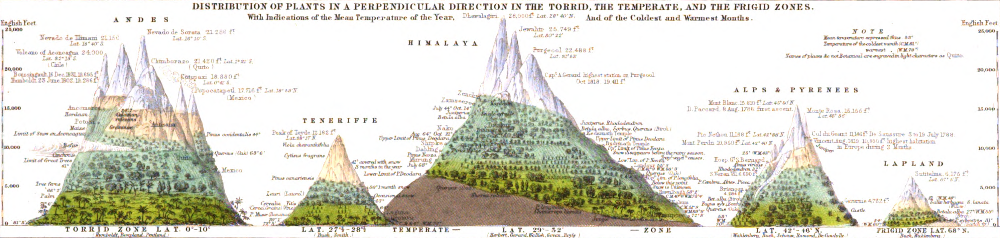

On smaller scale (more human-sized) features like hills or dunes, the
landscape is dominated instead by ambient lighting and how the sun hits
the surface. Here’s an example from Great Sand Dunes National Park, in
Colorado. Note the (sometimes drastic) change in surface color that
changes depending on the time of day or direction of the light:


Rather than color by elevation, let’s try coloring the surface by the
direction the slope is facing and the steepness of that slope. This is
implemented in the rayshader function, `sphere_shade()`. Here’s a video
explanation of how it works:

[](https://www.tylermw.com/wp-content/uploads/2018/06/fullcombined_web.mp4)

Taking data and pluging it into the `sphere_shade()` function, here’s
what we get:

``` r
hobart_mat %>%
  sphere_shade() %>%
  plot_map()
```

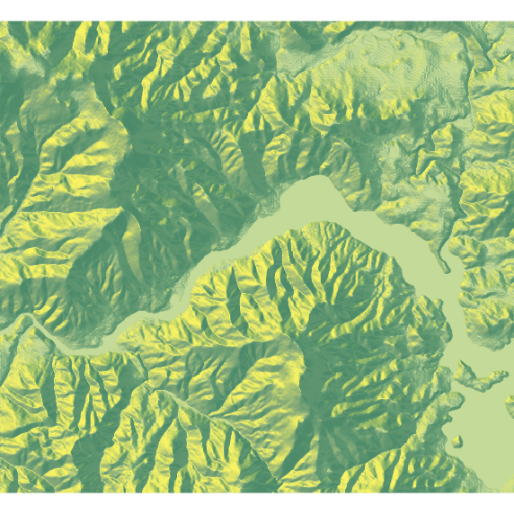

We note right away that it’s much more apparent in this hillshade that
there is a body of water weaving between the two mountains. To add water
to the scene we’ll call two functions in rayshader, `detect_water()` and
`add_water()`, that allow you to detect and add bodies of water directly
to the map using only the elevation data. `detect_water()` works by
looking for large, relatively flat, connected regions in a DEM. It’s
often the case (although not always) that the areas representing water
are far more flat than anything else in the matrix, so we take advantage
of that fact to extract and color in the water areas.

Occasionally these functions can result in false positives, but there
are tuning parameters to help. `detect_water()` provides the parameters
`min_area`, `max_height`, and `cutoff` in `detect_water()` so the user
can try to minimize false areas reported as water. `min_area` specifies
the minimum number of connected flat points that constitute a body of
water. `max_height` sets the maximum height that a region can be
considered to be water. `cutoff` determines how vertical a surface as to
be to be defined as flat: `cutoff = 1.0` only accepts areas pointing
straight up as water, while `cutoff = 0.99` allows for areas that are
slightly less than flat to be classified as water. The default is
`cutoff = 0.999`.

``` r
hobart_mat %>%
  sphere_shade() %>%
  add_water(detect_water(hobart_mat)) %>%
  plot_map()
```


The default `min_area` is 1/400th the area of the matrix. There’s
nothing special about this number, but it’s a default that tended to
work fairly well for several datasets I tested it on–adjust it to suit
your dataset. We will deal with elevation data later in the class where
the defaults for this function don’t work.

You can also start to see why rayshader was built using the pipe
operator `%>%`. Here’s what the previous code would look like without
the
pipe:

``` r
plot_map(add_water(sphere_shade(hobart_mat),detect_water(hobart_mat)))
```


The code is far more readable with the pipe, and the step-by-step
process of adding layers to our map is much more easy to see.

Both `sphere_shade()` and `add_water()` come with several built-in
palettes, and you can create your own with the `create_texture()`
function. Here’s the built-in textures (top is highlight color, and all
can be specified):


And here’s what a sampling of those textures look like (check the
documentation for more):

``` r
hobart_mat %>%
  sphere_shade(texture = "desert") %>%
  add_water(detect_water(hobart_mat), color = "desert") %>%
  plot_map()
```


``` r
hobart_mat %>%
  sphere_shade(texture = "imhof4") %>%
  add_water(detect_water(hobart_mat), color = "imhof4") %>%
  plot_map()
```

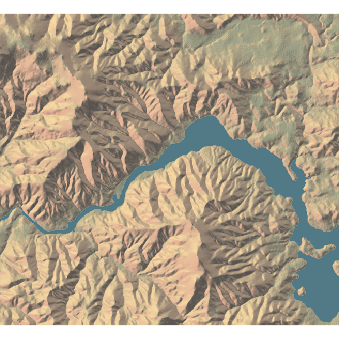

``` r
hobart_mat %>%
  sphere_shade(texture = "bw") %>%
  add_water(detect_water(hobart_mat), color = "unicorn") %>%
  plot_map()
```


Rayshader’s name comes one of the methods it uses to calculate
hillshades: raytracing, a method that realistically simulates how light
travels across the elevation model. Most traditional methods of
hillshading only use the local angle that the surface makes with the
light, and do not take into account areas that actually cast a shadow.
This basic type of hillshading is sometimes referred to as “lambertian”,
and is implemented in the function `lamb_shade()`. There’s one problem
with this mapping, though:

``` r
hobart_mat %>%
  lamb_shade(zscale = 33) %>%
  plot_map()
```


``` r
hobart_mat %>%
  lamb_shade(zscale = 33, sunangle = 135) %>%
  plot_map()
```

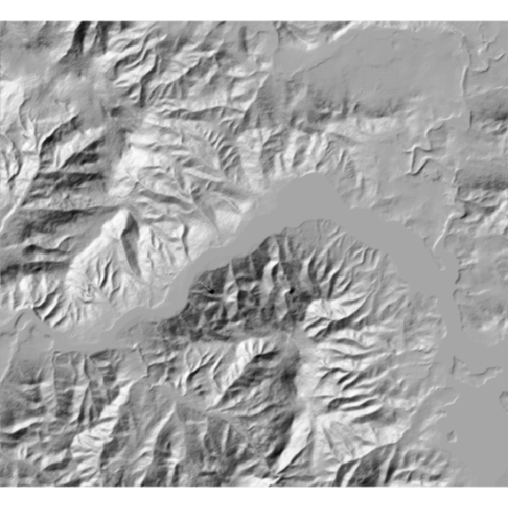

``` r
hobart_mat_inverted = -hobart_mat

hobart_mat %>%
  lamb_shade(zscale = 33) %>%
  plot_map()
```

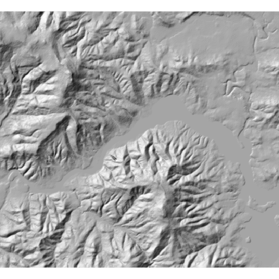

``` r
# No difference!
hobart_mat_inverted %>%
  lamb_shade(zscale = 33, sunangle = 135) %>%
  plot_map()
```

To shade surfaces using raytracing, rayshader draws rays originating
from each point towards a light source, specified using the `sunangle`
and `sunaltitude` argument. Here are two gifs showing how rayshader
calculates shadows with `ray_shade`:


Since our data is represented by grid points, rayshader uses a method
called “bilinear interpolation” to determine if there are intersections
with the ground even between points.


Let’s add a layer of shadows to this map, using the `add_shadow()` and
`ray_shade()` functions. We layer our shadows to our `lamb_shade()` base
layer.

``` r
hobart_mat %>%
  lamb_shade(zscale = 33) %>%
  add_shadow(ray_shade(hobart_mat, zscale = 33, 
                       sunaltitude = 6, lambert = FALSE), 0.3) %>%
  plot_map()
```

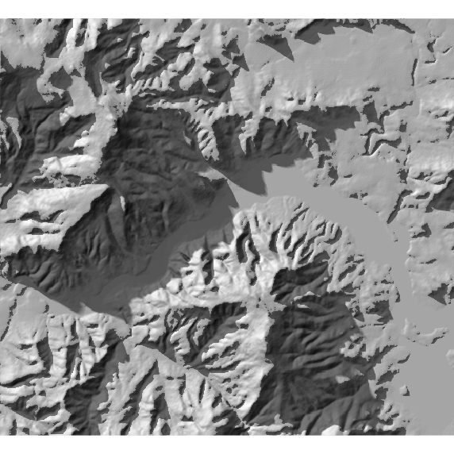

``` r
# No longer identical--we can tell canyons from mountains, thanks to raytracing
hobart_mat_inverted %>%
  lamb_shade(zscale = 33, sunangle = 135) %>%
  add_shadow(ray_shade(hobart_mat_inverted, zscale = 33, sunangle = 135,
                       sunaltitude = 6, lambert = FALSE), 0.3) %>%
  plot_map()
```


We can combine all these together to make our final 2D map:

``` r
hobart_mat %>%
  sphere_shade() %>%
  add_water(detect_water(hobart_mat), color = "lightblue") %>%
  add_shadow(ray_shade(hobart_mat,zscale = 33, sunaltitude = 3,lambert = FALSE), max_darken = 0.5) %>%
  add_shadow(lamb_shade(hobart_mat,zscale = 33,sunaltitude = 3), max_darken = 0.5) %>%
  plot_map()
```


We can adjust the highlight/sun direction using the `sunangle` argument
in both the `sphere_shade()` function and the `ray_shade()` function.

We’ll start with the default angle: 315 degrees, or the light from the
Northwest. One question you might ask yourself is: Why 315 degrees?

``` r
#Default angle: 315 degrees.

hobart_mat %>%
  sphere_shade() %>%
  add_water(detect_water(hobart_mat), color = "lightblue") %>%
  add_shadow(ray_shade(hobart_mat, zscale = 33, sunaltitude = 5,lambert = FALSE), 
             max_darken = 0.5) %>%
  add_shadow(lamb_shade(hobart_mat,zscale = 33,sunaltitude = 5), max_darken = 0.8) %>%
  plot_map()
```

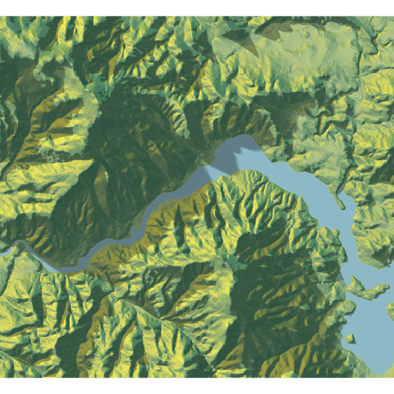

``` r
#225 degrees

hobart_mat %>%
  sphere_shade(sunangle = 225) %>%
  add_water(detect_water(hobart_mat), color = "lightblue") %>%
  add_shadow(ray_shade(hobart_mat,sunangle = 225, zscale = 33, sunaltitude = 5,lambert = FALSE), 
             max_darken = 0.5) %>%
  add_shadow(lamb_shade(hobart_mat,zscale = 33,sunaltitude = 5), max_darken = 0.8) %>%
  plot_map()
```

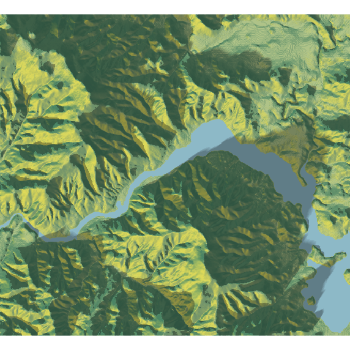

You have complete freedom in choosing how your map is lit. And, as we
will show later, you can use the `suncalc` package to bring in the
actual position of the sun in the sky for a specific times and
locations.


We can also add the effect of ambient occlusion, which is sometimes
referred to as the “sky view factor.” When light travels through the
atmosphere, it scatters. This scattering turns the entire sky into a
light source, so when less of the sky is visible (e.g. in a valley) it’s
darker than when the entire sky is visible (e.g. on a mountain ridge).

Let’s calculate the ambient occlusion shadow layer for the Hobart data,
and layer it onto the rest of the map.

``` r
hobart_mat %>%
  ambient_shade() %>%
  plot_map()
```

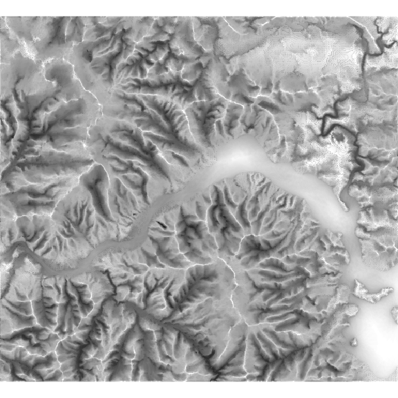

``` r
#No ambient occlusion
hobart_mat %>%
  sphere_shade() %>%
  add_water(detect_water(hobart_mat), color = "lightblue") %>%
  add_shadow(ray_shade(hobart_mat, zscale = 33, sunaltitude = 5,lambert = FALSE), 
             max_darken = 0.5) %>%
  add_shadow(lamb_shade(hobart_mat,zscale = 33, sunaltitude = 5), max_darken = 0.7) %>%
  plot_map()
```

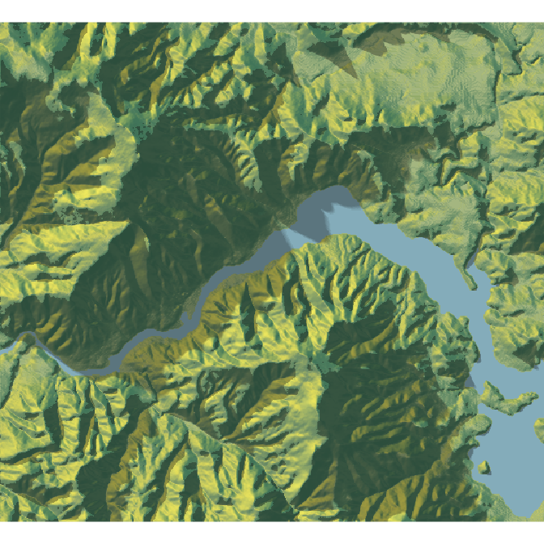

``` r
#With ambient occlusion
hobart_mat %>%
  sphere_shade() %>%
  add_water(detect_water(hobart_mat), color = "lightblue") %>%
  add_shadow(ray_shade(hobart_mat, zscale = 33, sunaltitude = 5,lambert = FALSE), 
             max_darken = 0.5) %>%
  add_shadow(lamb_shade(hobart_mat,zscale = 33, sunaltitude = 5), max_darken = 0.7) %>%
  add_shadow(ambient_shade(hobart_mat), max_darken = 0.1) %>%
  plot_map()
```

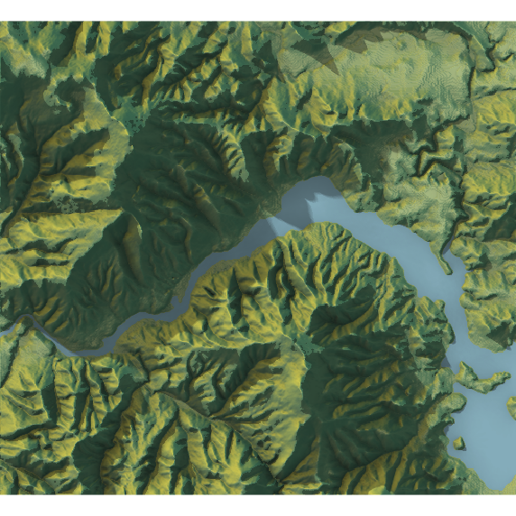

We can save these plots straight to disk, without displaying them, using
the `save_png()` function instead of `plot_map()`.

``` r
hobart_mat %>%
  sphere_shade() %>%
  save_png("filename.png")

unlink("filename.png")
```

# 3D Mapping with Rayshader

Now that we know how to perform basic hillshading, we can begin the real
fun part: making 3D maps. In rayshader, we do that simply by swapping
out `plot_map()` with `plot_3d()`, and adding the heightmap to the
function call. We don’t want to re-compute the ambient\_shade() layer
every time we re-plot the landscape, so lets save it to a variable.

``` r
ambientshadows = ambient_shade(hobart_mat)

hobart_mat %>%
  sphere_shade() %>%
  add_water(detect_water(hobart_mat), color = "lightblue") %>%
  add_shadow(ray_shade(hobart_mat, sunaltitude = 3, zscale = 33, lambert = FALSE), max_darken = 0.5) %>%
  add_shadow(lamb_shade(hobart_mat, sunaltitude = 3, zscale = 33), max_darken = 0.7) %>%
  add_shadow(ambientshadows, max_darken = 0.1) %>%
  plot_3d(hobart_mat, zscale = 10,windowsize = c(1000,1000))

render_snapshot()
```


``` r
rgl::rgl.clear()
```

This opens up an `rgl` window that displays the 3D plot. Draw to
manipulate the plot, and control/ctrl drag to zoom in and out. To close
it, we can either close the window itself, or type in
`rgl::rgl.close()`.

Just visualizing this on your screen is fun when exploring the data, but
we would also like to export our figure to an image file. If you want to
take a snapshot of the current view, rayshader provides the
`render_snapshot()` function, which is useful for rmarkdown documents
like this. If you use this without a filename, it will write and display
the plot to the current device. With a filename, it will write the image
to a PNG file in the local directory. For variety, let’s also change the
background/shadow color (arguments `background` and `shadowcolor`),
depth of rendered ground/shadow (arguments `soliddepth` and
`shadowdepth`), and add a title to the plot.

``` r
hobart_mat %>%
  sphere_shade() %>%
  add_water(detect_water(hobart_mat), color = "lightblue") %>%
  add_shadow(ray_shade(hobart_mat, sunaltitude = 3, zscale = 33, lambert = FALSE), max_darken = 0.5) %>%
  add_shadow(lamb_shade(hobart_mat, sunaltitude = 3, zscale = 33), max_darken = 0.7) %>%
  add_shadow(ambientshadows, max_darken = 0) %>%
  plot_3d(hobart_mat, zscale = 10,windowsize = c(1000,1000), 
          phi = 40, theta = 135, zoom = 0.9, 
          background = "grey30", shadowcolor = "grey5", 
          soliddepth = -50, shadowdepth = -100)

render_snapshot(title_text = "River Derwent, Tasmania", 
                title_font = "Helvetica", 
                title_size = 50,
                title_color = "grey90")
```


``` r
render_snapshot(filename = "derwent.png")

#Delete the file
unlink("derwent.png")
```

If we want to programmatically change the camera, we can do so with the
`render_camera()` function. We can adjust four parameters: `theta`,
`phi`, `zoom`, and `fov` (field of view). Changing `theta` orbits the
camera around the scene, while changing `phi` changes the angle above
the horizon at which the camera is located. Here is a graphic
demonstrating this relation (and [here’s a link to the video from the
presentation](https://www.tylermw.com/data/all.mp4) ):


`zoom` magnifies the current view (smaller numbers = larger
magnification), and `fov` changes the field of view. Higher `fov` values
correspond to a more pronounced perspective effect, while `fov = 0`
corresponds to a orthographic camera.

Here’s different views using the camera:

``` r
render_camera(theta = 90, phi = 30, zoom = 0.7, fov = 0)
render_snapshot()
```


``` r
render_camera(theta = 90, phi = 30, zoom = 0.7, fov = 90)
render_snapshot()
```


``` r
render_camera(theta = 120, phi = 20, zoom = 0.3, fov = 90)
render_snapshot()
```


We can also use some post-processing effects to help guide our viewer
through our visualization’s 3D space. The easiest method of directing
the viewer’s attention is directly labeling the areas we’d like them to
look at, using the `render_label()` function. This function takes the
indices of the matrix coordinate area of interest `x` and `y`, and
displays a `text` label at altitude `z`. We’ll also use the
`title_bar_color` argument to add a semi-transparent light bar behind
our title to help it stand out from the
background.

``` r
render_label(hobart_mat, "River Derwent", textcolor ="white", linecolor = "white",
             x = 450, y = 260, z = 1400, textsize = 2.5, linewidth = 4, zscale = 10)
render_snapshot(title_text = "render_label() demo, part 1", 
                title_bar_alpha = 0.8,
                title_bar_color = "white")
```


``` r
render_label(hobart_mat, "Jordan River (not that one)", textcolor ="white", linecolor = "white",
             x = 450, y = 140, z = 1400, textsize = 2.5, linewidth = 4, zscale = 10, dashed = TRUE)
render_snapshot(title_text = "render_label() demo, part 2", 
                title_bar_alpha = 0.8,
                title_bar_color = "white")
```

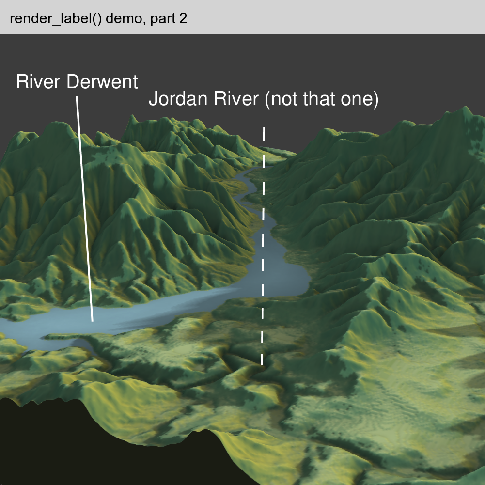

We can replace all existing text with the `clear_previous = TRUE`, or
clear everything by calling `render_label(clear_previous = TRUE)` with
no other arguments.

``` r
render_camera(zoom = 0.9, phi = 50, theta = -45,fov = 0)
render_snapshot()
```


``` r
render_label(hobart_mat, "Mount Faulkner", textcolor ="white", linecolor = "white",
             x = 135, y = 130, z = 2500, textsize = 2, linewidth = 3, zscale = 10, clear_previous = TRUE)
render_snapshot()
```


``` r
render_label(hobart_mat, "Mount Dromedary", textcolor ="white", linecolor = "white",
             x = 320, y = 390, z = 1000, textsize = 2, linewidth = 3, zscale = 10)
render_snapshot()
```


``` r
render_label(clear_previous = TRUE)
render_snapshot()
```


``` r
rgl::rgl.close()
```

This is not the only trick up our sleeve, though. Data visualization is
not the first field to tackle the problem of “How do I direct a viewer’s
attention in 3D space, projected on a 2D screen?” Cinematographers
encounter the same issue when they’re filming (except when using small
aperture sizes or lenses with short focal lengths). Below is a shot of
Daniel Craig in the movie “Defiance”:


Even though the 3D space this shot is representing is fairly deep (with
a distinct foreground, middle, and background), we know our attention is
supposed to be focused on the man in the center. The use of a shallow
depth of field tells our viewers what isn’t important, and where their
attention should be.

We can apply this same technique in rayshader using the `render_depth()`
function. This applies a depth of field effect, as if our scene was
being photographed by a real camera. Let’s focus in on the river in the
background. The `focus` parameter should be between 0 and 1, where 1 is
the background and 0 is the foreground. The range of depths will depend
on our camera position–calling the function with `preview_focus = TRUE`
will print the range in the current view, and you can use the red line
to see exactly where the focal plane will be positioned.

``` r
hobart_mat %>%
  sphere_shade(sunangle = 60) %>%
  add_water(detect_water(hobart_mat), color = "lightblue") %>%
  add_shadow(ray_shade(hobart_mat, sunangle = 60, sunaltitude = 3, zscale = 33, lambert = FALSE), max_darken = 0.5) %>%
  add_shadow(lamb_shade(hobart_mat, sunangle = 60, sunaltitude = 3, zscale = 33), max_darken = 0.7) %>%
  add_shadow(ambientshadows, max_darken = 0.1) %>%
  plot_3d(hobart_mat, zscale = 10,windowsize = c(1000,1000), 
          background = "#edfffc", shadowcolor = "#273633")

render_camera(theta = 120, phi = 20, zoom = 0.3, fov = 90)
render_depth(focus = 0.81, preview_focus = TRUE)
```

    ## [1] "Focal range: 0.61623-0.977782"

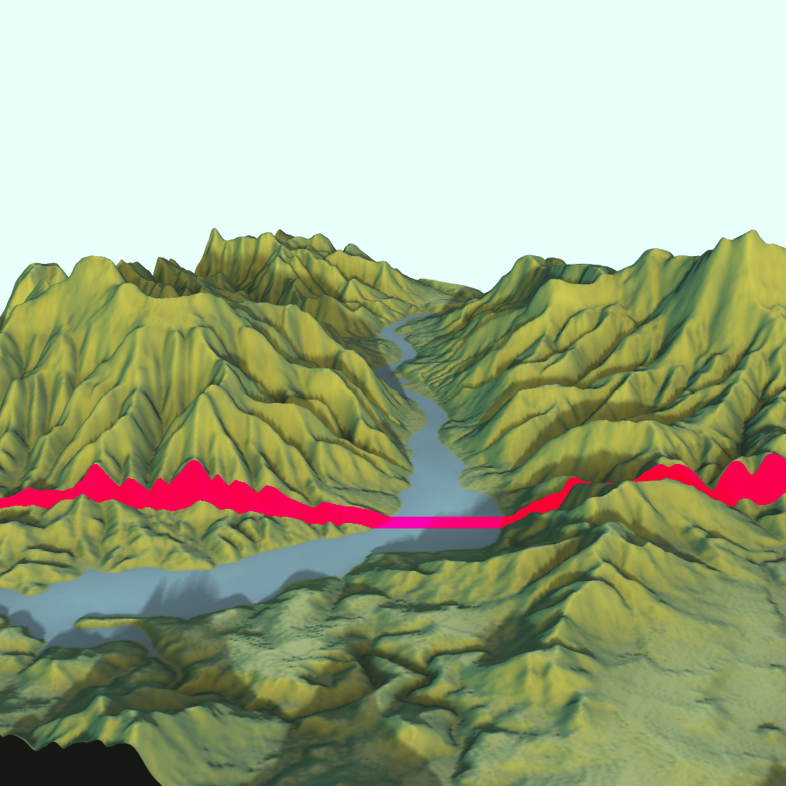

``` r
render_depth(focus = 0.9, preview_focus = TRUE)
```

    ## [1] "Focal range: 0.61623-0.977782"

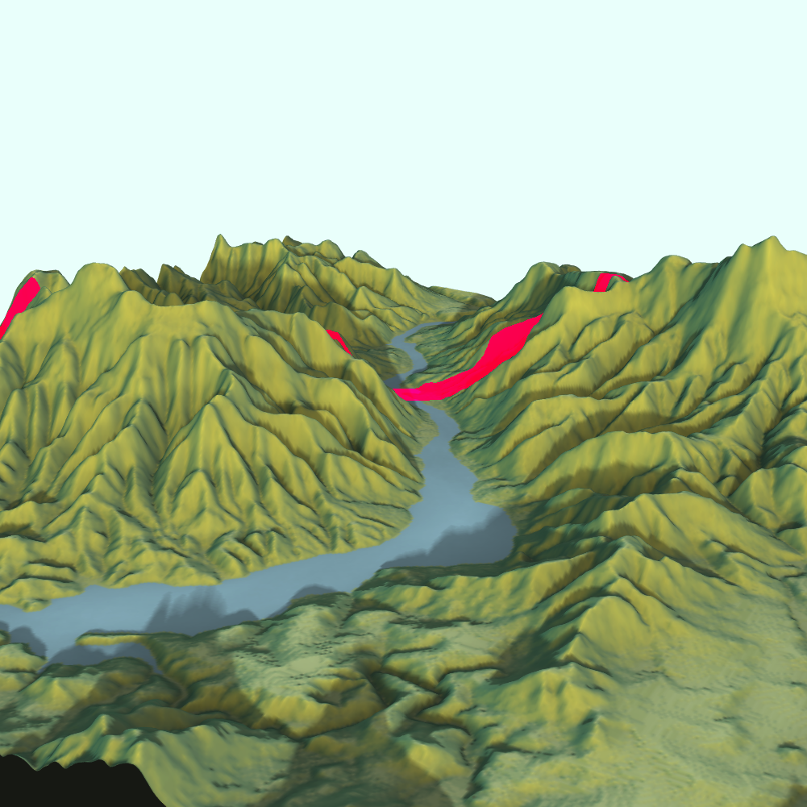

``` r
render_depth(focus = 0.81)
```


This effect is rather subtle, so let’s increase the focal length of the
camera using argument `focallength`. This will make for a shallower
depth of field (increase the blurring effect in areas far from the focal
plane). We can also add a `title_*` arguments like in
`render_snapshot()`, and we’ll add a lens vignetting effect (which
darkens the edges) by setting `vignette = TRUE`. This option is also
available in `render_snapshot()` and
`render_movie()`.

``` r
render_depth(focus = 0.81, focallength = 200, title_bar_color = "black", vignette = TRUE,
             title_text = "The River Derwent, Tasmania", title_color = "white", title_size = 50)
```

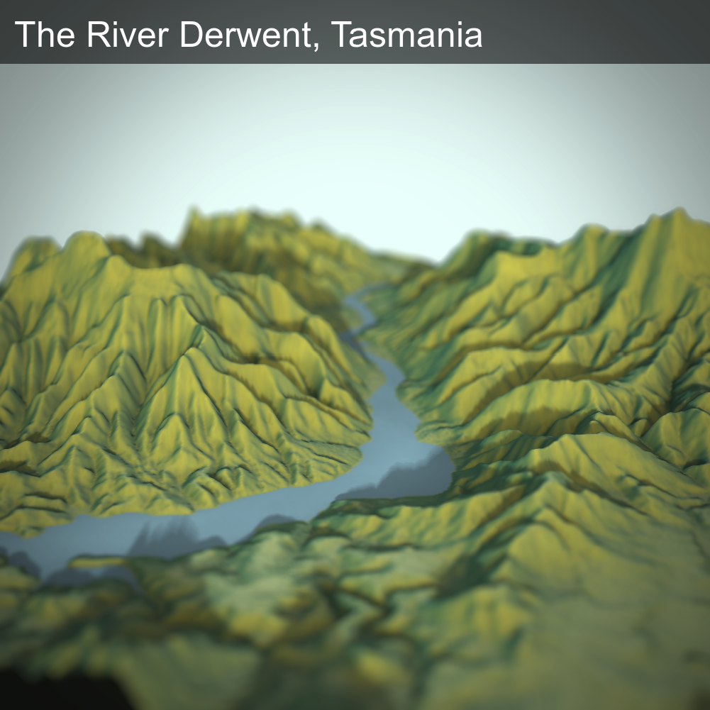

``` r
rgl::rgl.close()
```

Rayshader can be used for more than just topographic data
visualization–we can also easily visualize the intersection between
land and water. Here, we’ll use the built-in `montereybay` dataset,
which includes both bathymetric and topographic data for Monterey Bay,
California. We include a transparent water layer by setting `water =
TRUE` in `plot_3d()`, and add lines showing the edges of the water by
setting the `waterlinecolor` argument.

``` r
montereybay %>%
  sphere_shade() %>%
  plot_3d(montereybay, water = TRUE, waterlinecolor = "white",
          theta = -45, zoom = 0.9, windowsize = c(1000,1000),zscale = 50)
render_snapshot(title_text = "Monterey Bay, California", 
                title_color = "white", title_bar_color = "black")
```

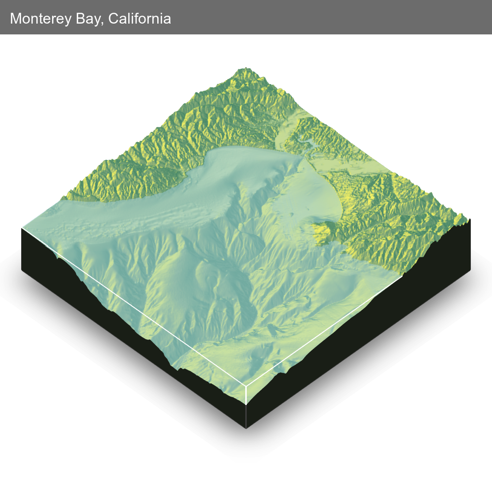

By default, `plot_3d()` sets the water level at 0 (sea level), but we
can change this, either by adjusting `waterdepth` in our call to
`plot_3d()`, or by calling the `render_water()` function after the fact.
Here, we make the water slightly less transparent with the `wateralpha`
argument (`wateralpha = 1` is opaque, `wateralpha = 0` is transparent).

``` r
render_water(montereybay, zscale = 50, waterdepth = -100, 
             waterlinecolor = "white", wateralpha = 0.7)
render_snapshot(title_text = "Monterey Bay, California (water level: -100 meters)", 
                title_color = "white", title_bar_color = "black")
```


``` r
render_water(montereybay, zscale = 50, waterdepth = 30, 
             waterlinecolor = "white", wateralpha = 0.7)
render_snapshot(title_text = "Monterey Bay, California (water level: 30 meters)", 
                title_color = "white", title_bar_color = "black")
```


``` r
rgl::rgl.close()
```

Although our underlying matrix data is rectangular, we aren’t limited to
rectangular 3D plots. Any entry in the matrix that has a value of `NA`
will be sliced out of the visualization. Here, we slice out just the
undersea data from the `montereybay` dataset. We still use the full
matrix to calculate the hillshade and shadows, but pass the sliced
elevation matrix to `plot_3d()`:

``` r
mont_bathy = montereybay
mont_bathy[mont_bathy >= 0] = NA

montereybay %>%
  sphere_shade() %>%
  add_shadow(ray_shade(mont_bathy,zscale = 50, sunaltitude = 15, lambert = FALSE),0.5) %>%
  plot_3d(mont_bathy, water = TRUE, waterlinecolor = "white",
          theta = -45, zoom = 0.9, windowsize = c(1000,1000))
```

    ## `montereybay` dataset used with no zscale--setting `zscale=50`.  For a realistic depiction, raise `zscale` to 200.

``` r
render_snapshot(title_text = "Monterey Bay Canyon", 
                title_color = "white", 
                title_bar_color = "black")
```


``` r
rgl::rgl.clear()
```

To slice out just the land, we’ll just swap the comparison:

``` r
mont_topo = montereybay
mont_topo[mont_topo < 0] = NA

montereybay %>%
  sphere_shade() %>%
  add_shadow(ray_shade(mont_topo, zscale = 50, sunaltitude = 15, lambert = FALSE),0.5) %>%
  plot_3d(mont_topo, shadowdepth = -50, 
          theta = 135, zoom = 0.9, windowsize = c(1000,1000))
```

    ## `montereybay` dataset used with no zscale--setting `zscale=50`.  For a realistic depiction, raise `zscale` to 200.

``` r
render_snapshot(title_text = "Monterey Bay (sans water)", 
                title_color = "white", 
                title_bar_color = "black")
```

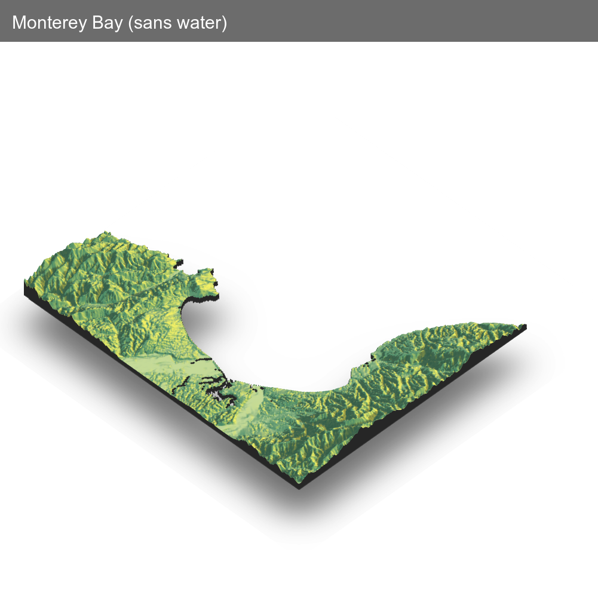

``` r
rgl::rgl.clear()
```

Alternatively, if we just want a more interesting base shape and we
don’t mind losing some data, we can have rayshader carve your dataset
into either a hexagon or a circle by specifying the `baseshape` argument
in `plot_3d()` (I also throw in some new background colors, shadow
colors, and the vignette effect for variety):

``` r
montereybay %>%
  sphere_shade() %>%
  add_shadow(ray_shade(montereybay,zscale = 50,sunaltitude = 15,lambert = FALSE),0.5) %>%
  plot_3d(montereybay, water = TRUE, waterlinecolor = "white", baseshape = "hex",
          theta = -45, zoom = 0.7, windowsize = c(1000,1000), 
          shadowcolor = "#4e3b54", background = "#f7e8fc")
```

    ## `montereybay` dataset used with no zscale--setting `zscale=50`.  For a realistic depiction, raise `zscale` to 200.

``` r
render_snapshot(title_text = "Monterey Bay Canyon, Hexagon",  vignette = TRUE,
                title_color = "white", title_bar_color = "black", clear = TRUE)
```


``` r
montereybay %>%
  sphere_shade() %>%
  add_shadow(ray_shade(montereybay,zscale = 50,sunaltitude = 15,lambert = FALSE),0.5) %>%
  plot_3d(montereybay, water = TRUE, waterlinecolor = "white", baseshape = "circle",
          theta = -45, zoom = 0.7, windowsize = c(1000,1000),
          shadowcolor = "#4f3f3a", background = "#ffeae3")
```

    ## `montereybay` dataset used with no zscale--setting `zscale=50`.  For a realistic depiction, raise `zscale` to 200.

``` r
render_snapshot(title_text = "Monterey Bay Canyon, Circle",
                title_color = "white", title_bar_color = "black", clear = TRUE)
```


Taking snapshots of our map is useful, but a static visualization isn’t
the ideal method to represent our 3D data. For the viewer, the depth
variable has to be inferred from context, which can be ambiguous and
easily misinterpreted. A far better form for our visualization is a
movie/animation–we can guide our viewers on a 3D tour of our data, which
can resolve many visual ambiguities. Rayshader makes this easy with the
`render_movie()` function, which creates a movie (mp4 file) which can
easily be shared on social media. You can add titles and all of the same
arguments you can to `render_snapshot()`.

By default, `render_movie()` has two animations built in: a basic orbit
`type = "orbit"`, an oscillating animation `type = "oscillate"`. The
`frames` argument is the number of frames, while the `fps` is the frames
per second. The total length of the video is frames/fps. Generally, you
shouldn’t change from either 30 or 60 frames per second if you want to
share your videos on social media. You also shouldn’t make the camera
move too fast or spin too quickly–fast camera movements can cause nausea
and aren’t very interpretable.

``` r
montereybay %>%
  sphere_shade() %>%
  plot_3d(montereybay, water = TRUE, waterlinecolor = "white",
          theta = -45, zoom = 0.9, windowsize = c(600,600))
```

    ## `montereybay` dataset used with no zscale--setting `zscale=50`.  For a realistic depiction, raise `zscale` to 200.

``` r
#Orbit will start with current setting of phi and theta
render_movie(filename = "montbay.mp4", title_text = 'render_movie(type = "orbit")', 
             phi = 30 , theta = -45)
```

    ## [1] "montbay.mp4"

``` r
render_movie(filename = "montbayosc.mp4", phi = 30 , theta = -90, type = "oscillate",
             title_text = 'render_movie(type = "oscillate")', title_color = "black")
```

    ## [1] "montbayosc.mp4"

``` r
unlink("montbay.mp4")
unlink("montbayosc.mp4")
```

You can also set `type = "custom"` and pass in a vector of camera values
to the `phi`, `theta`, `zoom`, and `fov` arguments, and each value will
be treated as a single frame in our animation. Here I’ve also provided
an “easing” function that smoothly transitions between two values, so we
can zoom in and out without jarring
changes.

``` r
ease_function = function(beginning, end, steepness = 1, length.out = 180) {
  single = (end) + (beginning - end) * 1/(1 + exp(seq(-10, 10, length.out = length.out)/(1/steepness)))
  single
}

zoom_values = c(ease_function(1,0.3), ease_function(0.3,1))

#This gives us a zoom that looks like this:
ggplot(data.frame(x = 1:360,y = zoom_values),) + 
  geom_line(aes(x = x,y = y),color = "red",size = 2) +
  ggtitle("Zoom value by frame")
```


``` r
render_movie(filename = "montbaycustom.mp4", type = "custom",
             phi = 30 + 15 * sin(1:360 * pi /180), 
             theta = -45 - 1:360, 
             zoom = zoom_values)
```

    ## [1] "montbaycustom.mp4"

``` r
rgl::rgl.close()

unlink("montbaycustom.mp4")
```

If you want to do something more advanced, like vary the water depth
between each frame or call `render_depth()` to create a depth of field
effect, you’ll need to generate the movie manually in a `for` loop.
Luckily, this is fairly simple using the `av` package. Let’s vary the
water level from the most recent ice age minimum of -130 meters to the
current sea level. We use the `av` package to combine them into a movie.

``` r
# montereybay %>%
#   sphere_shade(texture = "desert") %>%
#   plot_3d(montereybay, windowsize = c(600,600), 
#           shadowcolor = "#222244", background = "lightblue")
# 
# render_camera(theta = -90, fov = 70,phi = 30,zoom = 0.8)
# 
# for(i in 1:60) {
#   render_water(montereybay, zscale = 50, waterdepth = -60 - 60 * cos(i*pi*6/180), 
#                watercolor = "#3333bb",waterlinecolor = "white", waterlinealpha = 0.5)
#   render_snapshot(filename = glue::glue("iceage{i}.png"), title_size = 30, instant_capture = TRUE,
#                   title_text = glue::glue("Sea level: {round(-60 - 60 *cos(i*pi*6/180),1)} meters"))
# }
# 
# av::av_encode_video(glue::glue("iceage{1:60}.png"), output = "custom_movie.mp4", 
#                     framerate = 30)
# 
# rgl::rgl.close()
# 
# unlink(glue::glue("iceage{1:60}.png"))
# unlink("custom_movie.mp4")
```

Finally, I’m going to show you a really cool feature I’ve just recently
implemented: `render_highquality()`. This calls a powerful rendering
engine built-in to rayshader to create truly stunning 3D visualizations.
You can control the view entirely through the rgl
window–`render_highquality()` recreates the scene using the
`rayrender` package and returns a beautiful, pathtraced rendering with
realistic shadows and lighting. You can adjust the light(s) angle,
direction, color, and intensity, as well as add additional lights and
objects to the scene.

``` r
hobart_mat %>%
  sphere_shade(texture = "desert") %>%
  add_water(detect_water(hobart_mat), color = "desert") %>%
  plot_3d(hobart_mat, zscale = 10)
render_highquality()
```

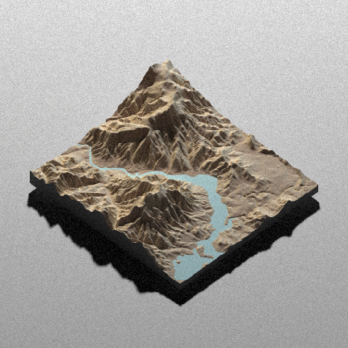

Notice we no longer need any of the shadow generating functions–the
shadows are calculated automatically as part of the rendering process.
You can adjust the light direction, or even add your own lights using
`rayrender`–it’s an extremely powerful tool to create visualizations.
You can decrease the noise by setting the `samples` argument to a higher
number in `render_highquality()` (default is 100).

Adding a custom light:

``` r
# `sphere()` and `diffuse()` are rayrender functions
render_highquality(light = FALSE, scene_elements = sphere(y = 150, radius = 30,material = diffuse(lightintensity = 40, implicit_sample = TRUE)))
```

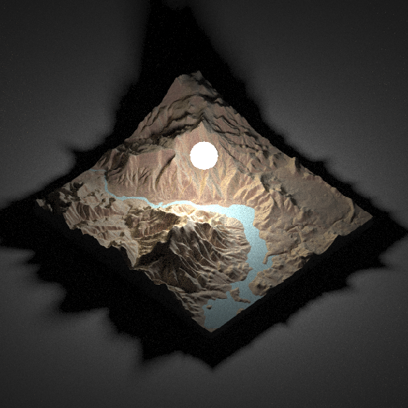

``` r
rgl::rgl.close()
```

Visualizing a 3D model with water:

``` r
montereybay %>%
  sphere_shade() %>%
  plot_3d(montereybay, zscale = 50, water = TRUE)
render_camera(theta = -45, zoom = 0.7, phi = 30,fov = 70)
render_highquality(lightdirection = 100, lightaltitude = 45, lightintensity = 800,
                   clamp_value = 10, title_text = "Monterey Bay, CA", 
                   title_color = "white", title_bar_color = "black")
```

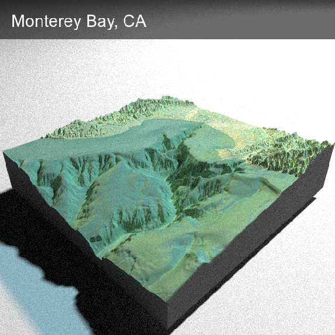

``` r
rgl::rgl.close()
```

# Elevation Data Sources

Here are some sources for downloading elevation/bathymetry data. I have
included several how-to PDF guides as
well.

## Philadelphia Guide

<https://github.com/tylermorganwall/MusaMasterclass/raw/master/data_source_guides/philly.pdf>
Alternate:
<https://dl.dropboxusercontent.com/s/5ls2gfjssosr2pa/philly.pdf?dl=0>

Source:
<https://maps.psiee.psu.edu/preview/map.ashx?layer=2021>

## Florida Guide

<https://github.com/tylermorganwall/MusaMasterclass/raw/master/data_source_guides/florida.pdf>
Alternate:
<https://dl.dropboxusercontent.com/s/adf1dsmytnw9f8c/florida.pdf>

Source:
<http://dpanther2.ad.fiu.edu/Lidar/lidarNew.php>

## Texas Guide

<https://github.com/tylermorganwall/MusaMasterclass/raw/master/data_source_guides/texas.pdf>
Alternate:
<https://dl.dropboxusercontent.com/s/89xs8yaet8s0x35/texas.pdf>

Source:
<https://tnris.org/stratmap/elevation-lidar/>

## SRTM/OpenTopography Global Elevation Data Guide

<https://github.com/tylermorganwall/MusaMasterclass/raw/master/data_source_guides/srtm_global.pdf>
Alternate:
<https://dl.dropboxusercontent.com/s/zu46o6ilzejy6gx/srtm_global.pdf?dl=0>

Source:
<http://opentopo.sdsc.edu/raster?opentopoID=OTSRTM.082015.4326.1>

## GEBCO Global Bathymetry Data Guide

<https://github.com/tylermorganwall/MusaMasterclass/raw/master/data_source_guides/gebco_global_bathymetry.pdf>
Alternate:
<https://dl.dropboxusercontent.com/s/i0regel891xajz3/gebco_global_bathymetry.pdf>

Source: <https://download.gebco.net>

# Mapping the Effects of Rising Sea Levels

How are coastal communities impacted by rising sea levels? That’s one of
the most pressing problems presented by our changing climate. Actually
showing how communities are affected by rising sea levels by visualizing
the water level directly is, in my opinion, far more impactful than just
discussing the numbers. Here, we’re going to combine lidar data from
Miami Beach and predictions about sea level rise to show how that
community will be affected.

We’re not just going to take into account sea level rise–climate change
results in warmer oceans, which in turn results in more powerful
hurricanes. While gradual sea level rise might be countered by levees
and seawalls, these hurricanes bring storm surges that can completely
overwhelm and inundate coastal cities. And since Miami is directly in
the predicted path of many hurricanes, it’s important we take that into
account.

Here’s a link to a Google Maps view of the region we’re going to
analyze:

<https://www.google.com/maps/place/Miami+Beach,+FL/@25.7438709,-80.1337059,1428a,35y,345.64h,57.55t/data=!3m1!1e3!4m5!3m4!1s0x88d9a6172bfeddb9:0x37be1741259463eb!8m2!3d25.790654!4d-80.1300455>

We’re going to model the most extreme scenario: 10.7 ft sea level rise
by the year 2100, with a 9 ft storm surge. Our data is in the Florida
East State Plane coordinate system, so the elevation is in feet. I
pulled the following two datasets from this website (follow the [guide
for
Florida](https://github.com/tylermorganwall/MusaMasterclass/raw/master/data_source_guides/florida.pdf)
to download your own data):

<http://dpanther2.ad.fiu.edu/Lidar/lidarNew.php>

Now, let’s load some lidar data into R. We’ll do this using the
`whitebox` package, which has several functions for manipulating and
transforming lidar data, among many other useful features. Many lidar
datasets are far too large to easily visualize, and are often noisy–we
are going to use `whitebox` to clean the data, and turn it into a simple
elevation model that includes buildings. This can take a minute, so I’ve
commented out the below code–you can run it if you want.

``` r
## Download this lidar data
# download.file("https://dl.dropboxusercontent.com/s/hkdxt1zbsjp68jl/LID2007_118755_e.zip",destfile = "LID2007_118755_e.zip")
# download.file("https://dl.dropboxusercontent.com/s/omvb63urfby6ddb/LID2007_118754_e.zip",destfile = "LID2007_118754_e.zip")

##Alternate links
# download.file("www.tylermw.com/data/LID2007_118755_e.zip",destfile = "LID2007_118755_e.zip")
# download.file("www.tylermw.com/data/LID2007_118754_e.zip",destfile = "LID2007_118754_e.zip")
# 
# unzip("LID2007_118755_e.zip")
# unzip("LID2007_118754_e.zip")
# 
# whitebox::wbt_lidar_tin_gridding(path.expand("~/Desktop/musa/LID2007_118755_e.las"),
#                                  output = path.expand("~/Desktop/musa/miamibeach.tif"),
#                                   resolution = 1, verbose_mode = TRUE,
#                                  exclude_cls = '3,4,5,7,13,14,15,16,18')
# 
# whitebox::wbt_lidar_tin_gridding(path.expand("~/Desktop/musa/LID2007_118754_e.las"),
#                                  output = path.expand("~/Desktop/musa/miamibeach2.tif"),
#                                   resolution = 1, verbose_mode = TRUE,
#                                  exclude_cls = '3,4,5,7,13,14,15,16,18')
```

While this runs, let’s talk about general limitations you’ll encounter
when dealing with lidar data. If you notice, you’ll see `whitebox`
actually isn’t loading any data into your environment, and for good
reason. R is memory hungry, and processing a full lidar dataset would be
difficult on most standard machines. The `whitebox` package operates on
files outside of R, and outputs a processed file when it’s done. Once
the data is transformed from a collection of lidar point measurements to
a regular grid of elevation values, we can load it into R and get to
work.


We’re using whitebox to remove several categories of points in the
data–here’s a table of what these numbers (passed in argument
`exclude_cls`) are referring to:

| CLS | Classification                       |
| --- | ------------------------------------ |
| 0   | Never classified                     |
| 1   | Unassigned                           |
| 2   | Ground                               |
| 3   | Low Vegetation                       |
| 4   | Medium Vegetation                    |
| 5   | High Vegetation                      |
| 6   | Building                             |
| 7   | Low Point                            |
| 9   | Water                                |
| 10  | Rail                                 |
| 11  | Road Surface                         |
| 13  | Wire - Guard (Shield)                |
| 14  | Wire - Conductor (Phase)             |
| 15  | Transmission Tower                   |
| 16  | Wire-Structure Connector (Insulator) |
| 17  | Bridge Deck                          |
| 18  | High Noise                           |

Let’s download the pre-processed tifs, if you aren’t generating them
from the lidar
data:

``` r
download.file("https://dl.dropboxusercontent.com/s/rwajxbdwtkcw50c/miamibeach.tif", destfile = "miamibeach.tif")
download.file("https://dl.dropboxusercontent.com/s/39abkh87h05n7rm/miamibeach2.tif", destfile = "miamibeach2.tif")

## Alternate Links
# download.file("www.tylermw.com/data/miamibeach.tif", destfile = "miamibeach.tif")
# download.file("www.tylermw.com/data/miamibeach2.tif", destfile = "miamibeach2.tif")
```

We’ll load them in with the raster package, and then merge to the two
together. Because they came from the same source, they have the same
coordinate system, so the merge here happens seamlessly. We then convert
the raster to a matrix.

``` r
miami1 = raster::raster("miamibeach.tif")
miami2 = raster::raster("miamibeach2.tif")

miami_combined = raster::merge(miami1, miami2)

miami_beach = raster_to_matrix(miami_combined)

dim(miami_beach)
```

    ## [1] 10000  5000

This is very large\! Too large to easily visualize. Let’s downsample the
data by a factor of 4.

``` r
# 1/4th the size, so 0.25 for the second argument
miami_beach_small = reduce_matrix_size(miami_beach, 0.25) 
dim(miami_beach_small)
```

    ## [1] 2500 1250

``` r
miami_beach_small %>%
  sphere_shade(texture = "desert") %>%
  add_water(detect_water(miami_beach_small,zscale = 4)) %>%
  add_shadow(ray_shade(miami_beach_small, zscale = 4, multicore = TRUE, 
                       sunaltitude = 10, sunangle = -110),0.3) %>%
  plot_map()
```

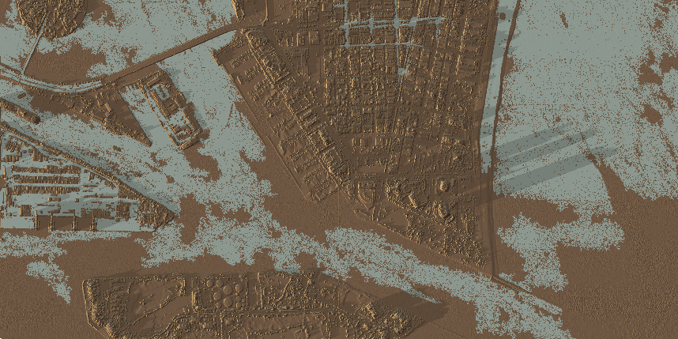

Detect water didn’t work great here. This is because the lidar is
actually returning the water surface–you can see ripples and waves where
the water should be. It’s not perfectly flat, so we need to adjust the
parameters to get it to work.

``` r
miami_beach_small %>%
  sphere_shade(texture = "desert") %>%
  add_water(detect_water(miami_beach_small, cutoff=0.2, zscale=4,
                         min_area = length(miami_beach_small)/150,
                         max_height = 3)) %>%
  add_shadow(ray_shade(miami_beach_small, zscale = 4, multicore = TRUE, 
                       sunaltitude = 10, sunangle = -110),0.3) %>%
  plot_map()
```

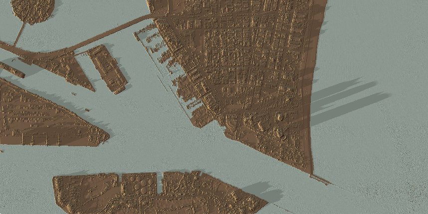

We should slice this map down to only the region of interest–Miami Beach
proper. We can do this with the `crop` function in the `raster` package.
We first create an `extent` object, which specifies the boundaries of
our map. We then convert the boundaries from lat/long to the coordinate
system of our lidar data, which is the Florida East State Plane. I have
provided a function here, `lat_long_to_other`, that performs this
transformation. You can use it with other coordinate systems as well–you
will just need to provide the “EPSG” code of the desired coordinate
system.

To figure out the desired latitudes and longitude boundaries for Miami
Beach, I went to Google Maps and double clicked on the points I wanted
to be the bottom left and top right of our map. Google Maps will display
the longitude and latitude at the bottom, which you can then just copy
and paste.

``` r
lat_long_to_other = function(lat,long, epsg_code) {
  data = data.frame(long=long, lat=lat)
  coordinates(data) <- ~ long+lat
  #Input--lat/long
  proj4string(data) <- CRS("+init=epsg:4326")
  #Convert to coordinate system specified by EPSG code
  xy = data.frame(spTransform(data, CRS(paste0("+init=epsg:", epsg_code))))
  colnames(xy) = c("x","y")
  return(unlist(xy))
}

# Florida East State Plane EPSG code is 2236
# I grabbed these latitudes and longitudes from double clicking on google maps
bottomleft = lat_long_to_other(25.763675, -80.142499, 2236)
topright = lat_long_to_other(25.775562, -80.127569, 2236)

# Create an extent object:
e = extent(c(bottomleft[1], topright[1], bottomleft[2], topright[2]))

# Use that extent object to crop the original grid to our desired area
crop(miami_combined, e) %>%
  raster_to_matrix() %>%
  reduce_matrix_size(0.25) -> 
miami_cropped 

miami_cropped %>%
  sphere_shade(texture = "desert") %>%
  add_water(detect_water(miami_cropped, cutoff = 0.3,
                         min_area = length(miami_cropped)/20,
                         max_height = 2)) %>%
  add_shadow(ray_shade(miami_cropped, zscale = 4, multicore = TRUE, 
                       sunaltitude = 30, sunangle = -110),0.3) %>%
  plot_map()
```

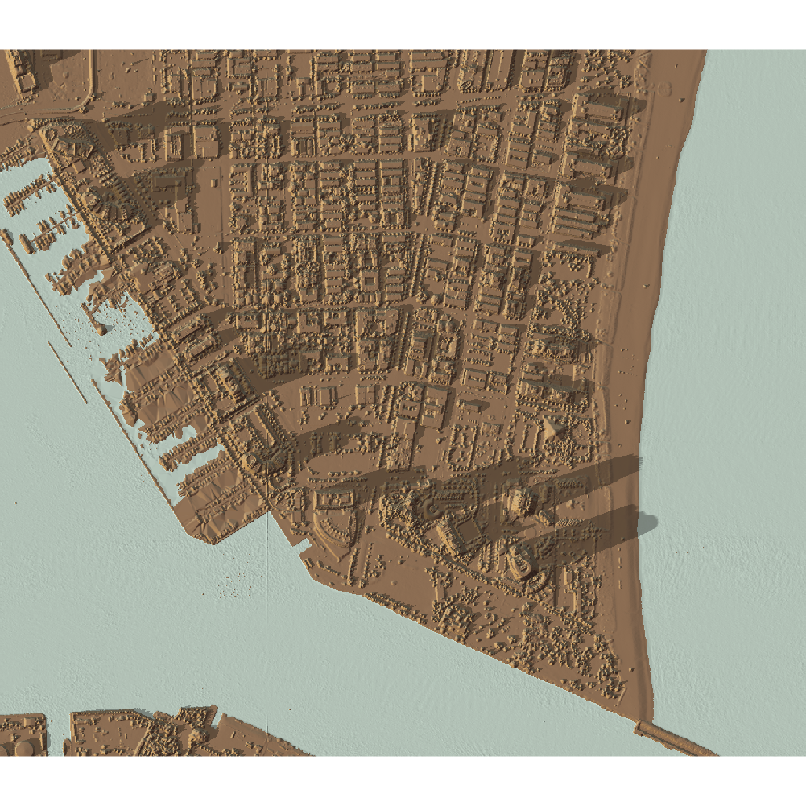

Cropped and ready. Now that we have our data prepped and reduced, let’s
visualize it in 3D. The coordinate system here is defined in feet, so
that’s what we’ll enter for the values of waterdepth.

``` r
miami_cropped %>%
  sphere_shade(texture = "desert") %>%
  add_shadow(ray_shade(miami_cropped, zscale = 4, multicore = TRUE),0.3) %>% 
  plot_3d(miami_cropped, zscale = 4, water = TRUE, waterdepth = 0,
          zoom=0.85, windowsize = 1000, 
          background = "grey50", shadowcolor = "grey20")

render_camera(phi = 45,fov = 70,zoom = 0.45,theta = 25)
render_snapshot(title_text = "Modern Day Miami Beach, Sea Level: 0 feet",
                title_bar_color = "black",
                title_color = "white", vignette = 0.2)
```

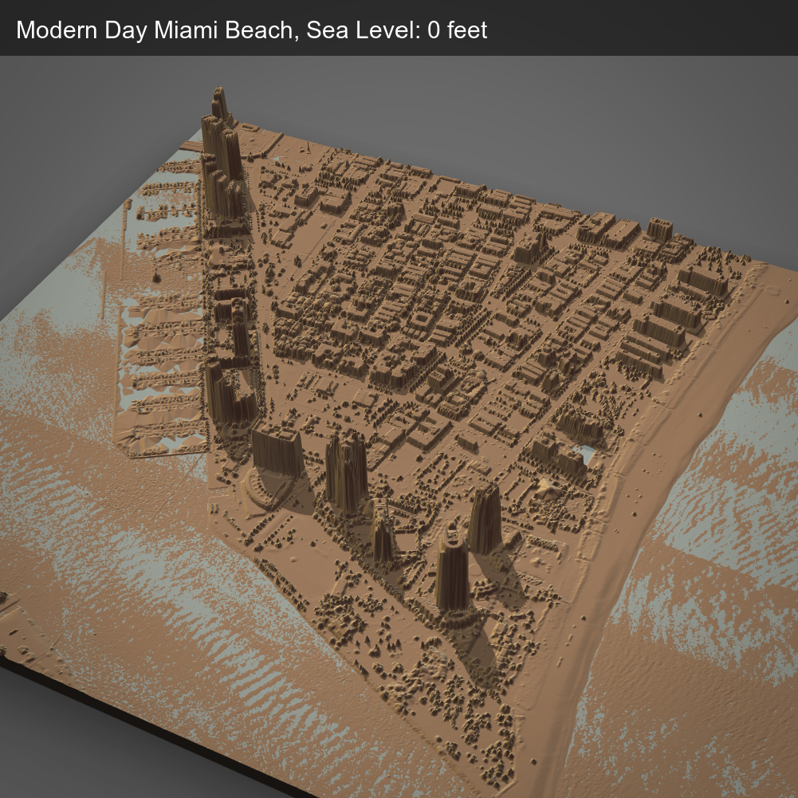

``` r
render_camera(phi = 45,fov = 70,zoom = 0.44,theta = 20)
render_water(miami_cropped,zscale = 4,waterdepth = 3)
render_snapshot(title_text = "Miami Beach, Sea Level: 3 feet",
                title_bar_color = "black",
                title_color = "white", vignette = 0.2)
```

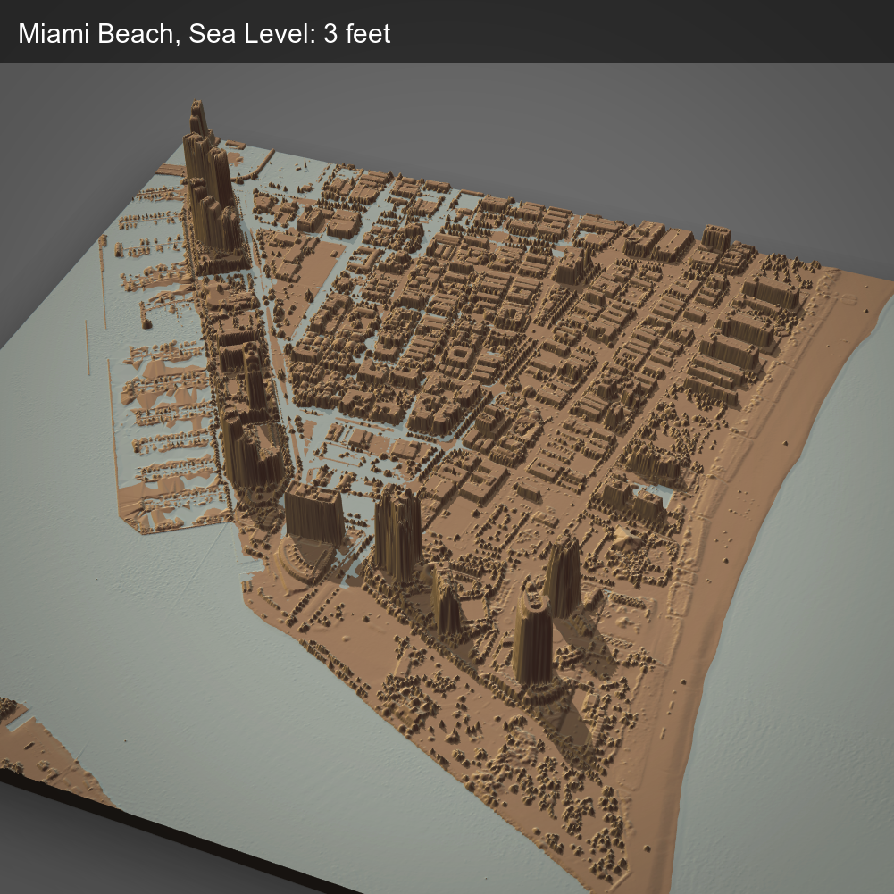

``` r
render_camera(phi = 45,fov = 70,zoom = 0.42,theta = 10)
render_water(miami_cropped,zscale = 4,waterdepth = 7)
render_snapshot(title_text = "Miami Beach, Sea Level: 7 feet (Max pred. 2100 sea level rise)",
                title_bar_color = "black",
                title_color = "white", vignette = 0.2)
```

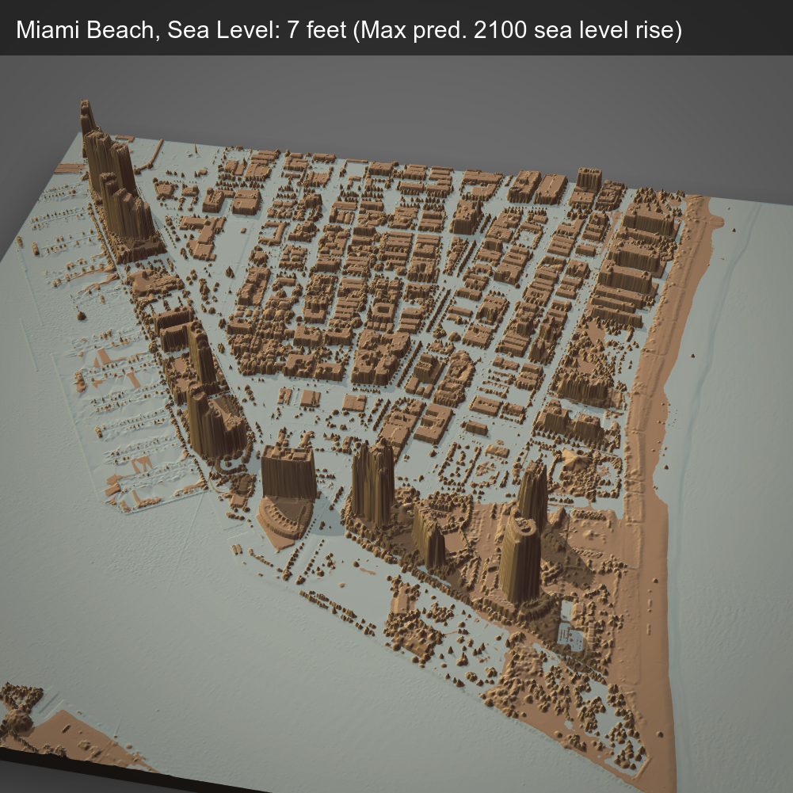

``` r
render_camera(phi = 45,fov = 70,zoom = 0.41,theta = 5)
render_water(miami_cropped,zscale = 4,waterdepth = 16)
render_snapshot(title_text = "Miami Beach, Sea Level: 16 feet (Max sea level rise + 9 ft storm surge)",
                title_size = 30,
                title_bar_color = "black",
                title_color = "white", vignette = 0.2)
```

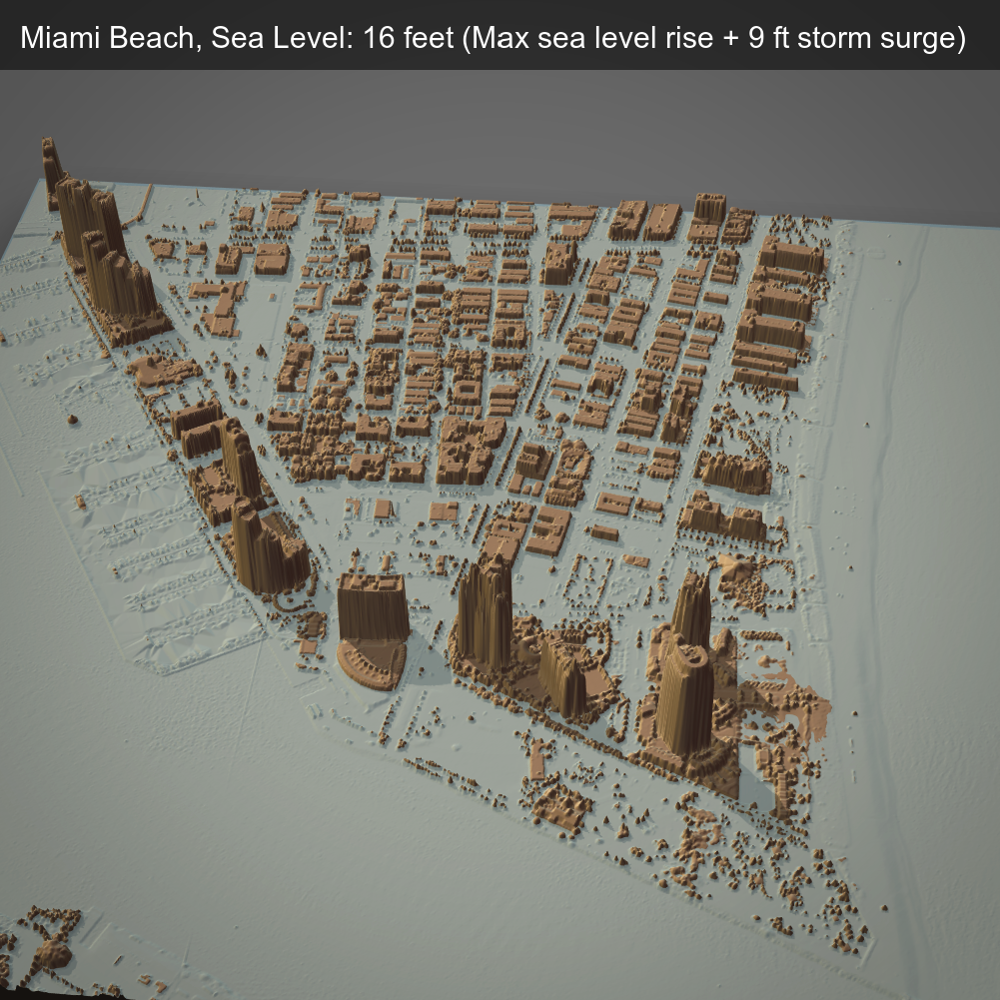

``` r
rgl::rgl.close()
```

Even with only a few feet of sea level rise, what we now consider to be
extreme flooding events will become far more common, and many areas by
the coast will become unlivable. We focused here on a relatively wealthy
part of the nation–visualizing sea level rise in well-known areas brings
out-sized attention to the problem–but this type of analysis is
important to perform for communities all along the coast. I encourage
you to grab elevation/lidar data for smaller coastal communities and see
how rising sea levels could affect them.

# Mapping the Shadows of Philadelphia

Now let’s use rayshader to perform an analysis using what it does best:
calculating shadows\! Back in 2015, the New York Times had a fantastic
piece by Quoctrung Bui and Jeremy White on mapping the shadows of New
York
City.

<https://www.nytimes.com/interactive/2016/12/21/upshot/Mapping-the-Shadows-of-New-York-City.html>

They took three days in the year and mapped out how much each spot in
the city spent in shadow: the winter solstice (December 21st), the
summer solstice (June 21st), and the autumnal equinox (Sept 22nd). They
worked with researchers at the Tandon school of Engineering at NYU to
develop a raytracer to perform these calculations. We don’t have access
to that tool, but we have lidar data and rayshader–that’s all we’ll
need. This type of analysis is particularly important to assess the
impact of so-called “pencil towers” that have gone up in
Manhattan–extremely tall, skinny skyscrapers lining Central Park and
catering to the super wealthy. How do tall buildings affect sunlight, a
shared common good and scarce resource in densely packed urban areas?

We are going to perform and visualize a similar analysis for a
hypothetical skyscraper in West Philadelphia, using lidar data from
Pennsylvania.

Let’s start by loading some lidar data into R. Here’s a link to the PDF
file with instructions on how to load data for
Philly.

<https://github.com/tylermorganwall/MusaMasterclass/raw/master/data_source_guides/philly.pdf>

Let’s walk through downloading a specific dataset:

<https://maps.psiee.psu.edu/preview/map.ashx?layer=2021>

Here, we’re going to load our lidar dataset of Penn Park, right by the
Schuylkill. We’re going to again use the whitebox package to prep the
data.

``` r
#291.3 MB
# download.file("https://dl.dropboxusercontent.com/s/2jge03ptvsley62/26849E233974N.zip", destfile = "26849E233974N.zip")

## Alternate Link
# download.file("https://www.tylermw.com/data/26849E233974N.zip", destfile = "26849E233974N.zip")

unzip("26849E233974N.zip")

whitebox::wbt_lidar_tin_gridding(path.expand("~/Desktop/musa/26849E233974N.las"),
                                 output = path.expand("~/Desktop/musa/phillydem.tif"), minz = 0,
                                 resolution = 1, exclude_cls = '3,4,5,7,13,14,15,16,18')
```

    ## [1] "lidar_tin_gridding - Elapsed Time (including I/O): 42.523s"

Now, let’s load the data into R.

``` r
phillyraster = raster::raster("phillydem.tif")

# backup in case whitebox doesn't work for you

download.file("https://dl.dropboxusercontent.com/s/3auywgq93lokurf/phillydem.tif", destfile = "phillydem.tif")

## Alternate Link
# download.file("https://www.tylermw.com/data/phillydem.tif", destfile = "phillydem.tif")

building_mat = raster_to_matrix(phillyraster)
```

A 2640x2640 matrix is easily processed in R, but it’s not ideal for
developing a visualization. Large matrices (greater than about
2000x2000, but depends on your machine) take a while to display in 3D.
It’s faster to prototype your visualizations using a smaller
dataset–once you are happy with the end result, you can re-run the
script with the original hi-res data. We’re time limited and our
visualization doesn’t require a high resolution dataset, so we won’t use
one. Let’s reduce it by a factor of 2.

``` r
building_mat_small = reduce_matrix_size(building_mat, 0.5)
dim(building_mat_small)
```

    ## [1] 1320 1320

We’ll start our analysis by calculating the shadows from the existing
buildings in this area, so we can compare the relative change with the
addition of our skyscraper. We will be using the `suncalc` package to
calculate the position of the sun in the sky over Philadelphia.
`suncalc::getSunlightPosition()` takes a date, time, latitude, and
longitude and returns the angular position of the sun in the sky. You
can also use `suncalc::getSunlightTimes()` to obtain the times for
sunrise and sunset.

This calculation isn’t that slow (~3 minutes), but it’s slow enough that
I’ve precomputed the
results:

``` r
getSunlightTimes(as.Date("2019-06-21"), lat = 39.9526, lon = -75.1652,tz = "EST")
```

    ##         date     lat      lon           solarNoon               nadir
    ## 1 2019-06-21 39.9526 -75.1652 2019-06-21 12:03:39 2019-06-21 00:03:39
    ##               sunrise              sunset          sunriseEnd
    ## 1 2019-06-21 04:33:22 2019-06-21 19:33:57 2019-06-21 04:36:38
    ##           sunsetStart                dawn                dusk
    ## 1 2019-06-21 19:30:40 2019-06-21 04:00:31 2019-06-21 20:06:47
    ##          nauticalDawn        nauticalDusk            nightEnd
    ## 1 2019-06-21 03:18:49 2019-06-21 20:48:29 2019-06-21 02:30:09
    ##                 night       goldenHourEnd          goldenHour
    ## 1 2019-06-21 21:37:09 2019-06-21 05:14:06 2019-06-21 18:53:13

``` r
#Start and hour after sunrise and end an hour before sunset
philly_time_start = ymd_hms("2019-06-21 05:30:00", tz = "EST")
philly_time_end= ymd_hms("2019-06-21 18:30:00", tz = "EST")

temptime = philly_time_start
philly_existing_shadows = list()
sunanglelist = list()
counter = 1

# while(temptime < philly_time_end) {
#   sunangles[[counter]] = suncalc::getSunlightPosition(date = temptime, lat = 39.9526, lon = -75.1652)[4:5]*180/pi
#   print(temptime)
#   philly_existing_shadows[[counter]] = ray_shade(building_mat_small,
#                                   sunangle = sunangles[[counter]]$azimuth+180,
#                                   sunaltitude = sunangles[[counter]]$altitude,
#                                   lambert = FALSE, zscale = 2,
#                                   multicore = TRUE)
#   temptime = temptime + duration("3600s")
#   counter = counter + 1
# }

#Downloading the pre-computed data to save time

download.file("https://dl.dropboxusercontent.com/s/ipgcg51ct8esg3w/philly_existing_shadows.Rds", 
              destfile = "philly_existing_shadows.Rds")
# download.file("https://www.tylermw.com/data/philly_existing_shadows.Rds", 
#               destfile = "philly_existing_shadows.Rds")

philly_existing_shadows = readRDS("philly_existing_shadows.Rds")
str(philly_existing_shadows)
```

    ## List of 13
    ##  $ : num [1:1320, 1:1320] 0.1 0.1 0.1 0.1 0.1 0.1 0.1 0.1 0.1 0.1 ...
    ##  $ : num [1:1320, 1:1320] 0.1 0.1 0.1 0.1 0.1 0.1 0.1 0.1 0.1 0.1 ...
    ##  $ : num [1:1320, 1:1320] 0.1 0.1 0.1 0.1 0.1 0.1 0.1 0.1 0.1 0.1 ...
    ##  $ : num [1:1320, 1:1320] 1 1 1 1 1 1 1 1 1 1 ...
    ##  $ : num [1:1320, 1:1320] 1 1 1 1 1 1 1 1 1 1 ...
    ##  $ : num [1:1320, 1:1320] 1 1 1 1 1 1 1 1 1 1 ...
    ##  $ : num [1:1320, 1:1320] 1 1 1 1 1 1 1 1 1 1 ...
    ##  $ : num [1:1320, 1:1320] 1 1 1 1 1 1 1 1 1 1 ...
    ##  $ : num [1:1320, 1:1320] 1 1 1 1 1 1 1 1 1 1 ...
    ##  $ : num [1:1320, 1:1320] 1 1 1 1 1 1 1 1 1 1 ...
    ##  $ : num [1:1320, 1:1320] 1 1 1 1 1 1 1 1 1 1 ...
    ##  $ : num [1:1320, 1:1320] 1 1 1 1 1 1 1 1 1 1 ...
    ##  $ : num [1:1320, 1:1320] 1 1 1 1 1 1 1 1 1 1 ...

``` r
plot_map(philly_existing_shadows[[2]])
```


``` r
# Pithy "data science" way
shadow_coverage = Reduce(`+`, philly_existing_shadows)/length(philly_existing_shadows)

## Verbose "programmer" way
#shadow_coverage = matrix(0, nrow(philly_existing_shadows), ncol(philly_existing_shadows))
#for(i in seq_len(length(philly_existing_shadows)) {
#  shadow_coverage = shadow_coverage + philly_existing_shadows[[i]]
#}
#shadow_coverage = shadow_coverage/length(philly_existing_shadows)

shadow_coverage %>%
  reshape2::melt(varnames = c("x","y"), value.name = "light") %>%
  ggplot() + 
  geom_raster(aes(x = x,y = y,fill = light)) +
  scale_fill_viridis_c("Daily Light\nCoverage") + 
  scale_x_continuous(expand = c(0,0)) + 
  scale_y_continuous(expand = c(0,0)) +
  coord_fixed()
```

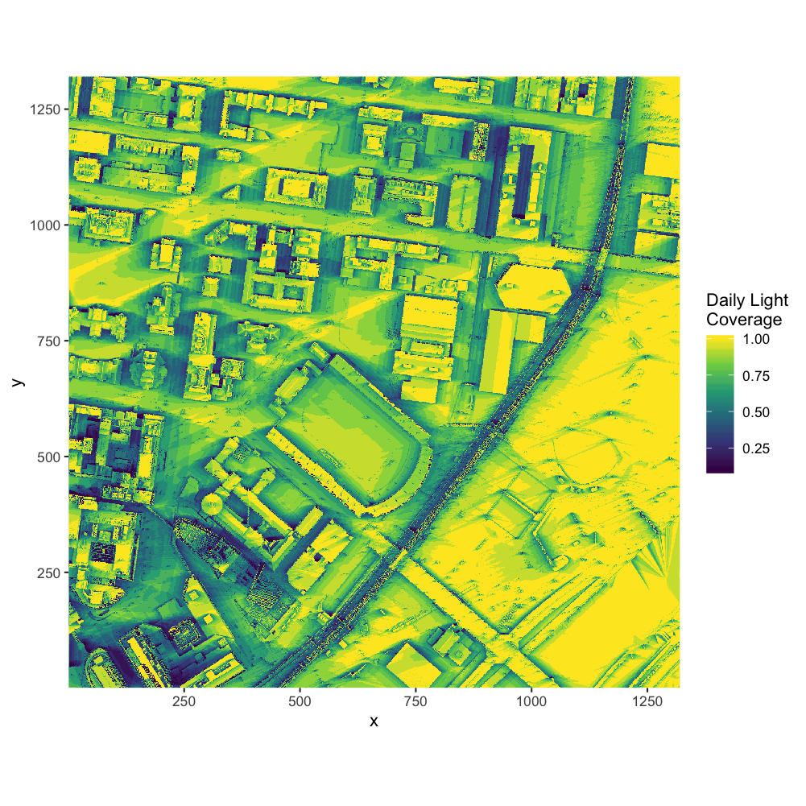

Now, let’s build our skyscraper in Penn Park. If we had an actual
building we wanted to model, we would create a polygon using the spatial
extent of the building and merge that with our raster. However, since
this building is entirely imaginary, we’re going to take a shortcut and
use a fun trick to draw it in our R graphics device, and merge that into
our raster. Let’s load in some functions to help us do this:

``` r
owin2Polygons = function(x, id = "1") {
  stopifnot(is.owin(x))
  x = as.polygonal(x)
  closering = function(df) { df[c(seq(nrow(df)), 1), ] }
  pieces = lapply(x$bdry,
                   function(p) {
                     Polygon(coords = closering(cbind(p$x,p$y)),
                             hole = is.hole.xypolygon(p))  })
  z = Polygons(pieces, id)
  return(z)
}

tess2SP = function(x) {
  stopifnot(is.tess(x))
  y = tiles(x)
  nam = names(y)
  z = list()
  for(i in seq(y))
    z[[i]] = owin2Polygons(y[[i]], nam[i])
  return(SpatialPolygons(z))
}

owin2SP = function(x) {
  stopifnot(is.owin(x))
  y = owin2Polygons(x)
  z = SpatialPolygons(list(y))
  return(z)
}
```

First, let’s plot our original raster. The `clickpoly` function from
`spatstat` allows you to click and define polygon vertices directly on
your R graphics device. We are going to create a building with four
vertices, and then use our helper functions to convert those vertices
into a spatial polygon. Then we rasterize that polygon onto the same
grid as our original data with the `rasterize` function, which also sets
the height of our skyscraper. Finally, using `merge`, we will combine
them into a single dataset and reduce the
resolution.

``` r
plot(phillyraster)
```


``` r
# ployval = clickpoly(nv = 4, add = TRUE)
# saveRDS(ployval,"polygon.Rds")
download.file("https://dl.dropboxusercontent.com/s/76u8ih1njjpxsr0/polygon.Rds", destfile = "polygon.Rds")
## Alternate Link
#download.file("https://www.tylermw.com/data/polygon.Rds", destfile = "polygon.Rds")

# Always check serialized objects for dangerous code before running them:
ployval = readRDS("polygon.Rds")
str(ployval)
```

    ## List of 5
    ##  $ type  : chr "polygonal"
    ##  $ xrange: num [1:2] 2686745 2686941
    ##  $ yrange: num [1:2] 234829 235042
    ##  $ bdry  :List of 1
    ##   ..$ :List of 2
    ##   .. ..$ x: num [1:4] 2686941 2686832 2686745 2686848
    ##   .. ..$ y: num [1:4] 234955 235042 234911 234829
    ##  $ units :List of 3
    ##   ..$ singular  : chr "unit"
    ##   ..$ plural    : chr "units"
    ##   ..$ multiplier: num 1
    ##   ..- attr(*, "class")= chr "unitname"
    ##  - attr(*, "class")= chr "owin"

``` r
test2 = rasterize(owin2SP(ployval), phillyraster, 400)
philly_with_building = merge(test2, phillyraster)

philly_with_building_mat = raster_to_matrix(philly_with_building)
philly_with_building_mat_small = reduce_matrix_size(philly_with_building_mat,0.5)
```

Now we’ll run the same analysis on the new lidar + building elevation
data. Here’s where the benefit of using a programming language instead
of a GUI to do GIS work becomes clear: to rerun this analysis with new
data, we just change the variable names but run the same
code.

``` r
getSunlightTimes(as.Date("2019-06-21"), lat = 39.9526, lon = -75.1652,tz = "EST")
```

    ##         date     lat      lon           solarNoon               nadir
    ## 1 2019-06-21 39.9526 -75.1652 2019-06-21 12:03:39 2019-06-21 00:03:39
    ##               sunrise              sunset          sunriseEnd
    ## 1 2019-06-21 04:33:22 2019-06-21 19:33:57 2019-06-21 04:36:38
    ##           sunsetStart                dawn                dusk
    ## 1 2019-06-21 19:30:40 2019-06-21 04:00:31 2019-06-21 20:06:47
    ##          nauticalDawn        nauticalDusk            nightEnd
    ## 1 2019-06-21 03:18:49 2019-06-21 20:48:29 2019-06-21 02:30:09
    ##                 night       goldenHourEnd          goldenHour
    ## 1 2019-06-21 21:37:09 2019-06-21 05:14:06 2019-06-21 18:53:13

``` r
#Start and hour after sunrise and end an hour before sunset
philly_time_start = ymd_hms("2019-06-21 05:30:00", tz = "EST")
philly_time_end= ymd_hms("2019-06-21 18:30:00", tz = "EST")

# temptime = philly_time_start
# philly_new_shadows = list()
# sunangles = list()
# counter = 1
# 
# while(temptime < philly_time_end) {
#   sunangles[[counter]] = suncalc::getSunlightPosition(date = temptime, lat = 39.9526, lon = -75.1652)[4:5]*180/pi
#   print(temptime)
#   philly_new_shadows[[counter]] = ray_shade(philly_with_building_mat_small,
#                                   sunangle = sunangles[[counter]]$azimuth+180,
#                                   sunaltitude = sunangles[[counter]]$altitude,
#                                   lambert = FALSE, zscale = 2,
#                                   multicore = TRUE)
#   temptime = temptime + duration("3600s")
#   counter = counter + 1
# }

#Downloading the pre-computed data to save time
download.file("https://dl.dropboxusercontent.com/s/rsfyplworlbi4x7/philly_new_shadows.Rds", 
              destfile = "philly_new_shadows.Rds")

## Alternate Link
# download.file("https://www.tylermw.com/data/philly_new_shadows.Rds", 
#               destfile = "philly_new_shadows.Rds")

philly_new_shadows = readRDS("philly_new_shadows.Rds")
str(philly_new_shadows)
```

    ## List of 13
    ##  $ : num [1:1320, 1:1320] 0.1 0.1 0.1 0.1 0.1 0.1 0.1 0.1 0.1 0.1 ...
    ##  $ : num [1:1320, 1:1320] 0.1 0.1 0.1 0.1 0.1 0.1 0.1 0.1 0.1 0.1 ...
    ##  $ : num [1:1320, 1:1320] 0.1 0.1 0.1 0.1 0.1 0.1 0.1 0.1 0.1 0.1 ...
    ##  $ : num [1:1320, 1:1320] 1 1 1 1 1 1 1 1 1 1 ...
    ##  $ : num [1:1320, 1:1320] 1 1 1 1 1 1 1 1 1 1 ...
    ##  $ : num [1:1320, 1:1320] 1 1 1 1 1 1 1 1 1 1 ...
    ##  $ : num [1:1320, 1:1320] 1 1 1 1 1 1 1 1 1 1 ...
    ##  $ : num [1:1320, 1:1320] 1 1 1 1 1 1 1 1 1 1 ...
    ##  $ : num [1:1320, 1:1320] 1 1 1 1 1 1 1 1 1 1 ...
    ##  $ : num [1:1320, 1:1320] 1 1 1 1 1 1 1 1 1 1 ...
    ##  $ : num [1:1320, 1:1320] 1 1 1 1 1 1 1 1 1 1 ...
    ##  $ : num [1:1320, 1:1320] 1 1 1 1 1 1 1 1 1 1 ...
    ##  $ : num [1:1320, 1:1320] 1 1 1 1 1 1 1 1 1 1 ...

``` r
new_shadow_coverage = Reduce(`+`, philly_new_shadows)/length(philly_new_shadows)

new_shadow_coverage %>%
  reshape2::melt(varnames = c("x","y"), value.name = "light") %>%
  ggplot() + 
  geom_raster(aes(x = x,y = y,fill = light)) +
  scale_fill_viridis_c("Daily Light\nCoverage", limits = c(0,1)) + 
  scale_x_continuous(expand = c(0,0)) + 
  scale_y_continuous(expand = c(0,0)) + 
  coord_fixed()
```

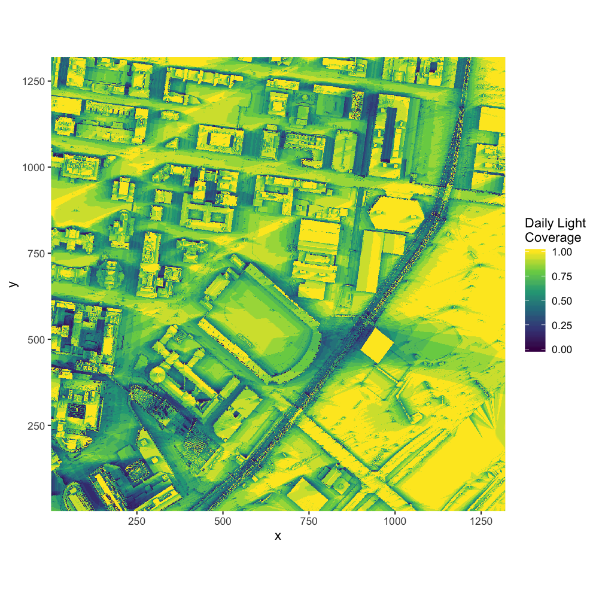

Let’s plot the decrease in total daily sunlight intensity when we add
the skyscraper. To do that, we’ll take the difference between the
current shadows and the shadows calculated with the building present.
Any negative values here represent an increase in sunlight, and only
occur on top of the skyscraper, so we’ll zero those out. We’ll then
subtract the resulting difference from 1 to show the relative total
daily reduction in sunlight at each point.

``` r
shadow_difference = (shadow_coverage - new_shadow_coverage)
shadow_difference[shadow_difference < 0] = 0

(1 - shadow_difference) %>%
  reshape2::melt(varnames = c("x","y"), value.name = "light") %>%
  ggplot() + 
  geom_raster(aes(x = x,y = y,fill = light)) +
  scale_fill_viridis_c("Relative Daily\nLight Coverage", limits = c(0,1)) + 
  scale_x_continuous(expand = c(0,0)) + 
  scale_y_continuous(expand = c(0,0)) +
  coord_fixed() +
  ggtitle("Total Daily Sunlight Reduction from \nHypothetical West Philly Skyscraper")
```


This visualization is okay, but without building outlines there’s a lot
of context missing. Luckily, we can use a quick trick to extract
building outlines from the elevation data–calculate the normal vector
(direction) at each point on the surface, and then only plot those
points that are tilted extremely horizontally. If you don’t know what’s
going on here, it’s okay–this is just a fun little
hack.

``` r
# Calculate normal vectors and extract z-component (we also need to reorient 
# the matrix--this should be fixed in future versions of rayshader)
abs(calculate_normal(building_mat_small,zscale = 4)$z) %>%
  t() %>%
  rayshader:::fliplr() ->
building_outlines
plot_map(building_outlines)
```


``` r
# Filter only those points that are facing at least 45 degrees outwards (the z-component
# of the unit-length normal vector is at most 1/2)
building_outlines %>%
  reshape2::melt(varnames = c("x","y"), value.name = "normal") %>%
  dplyr::filter(normal < 0.5) ->
existing_buildings_df

(1 - shadow_difference) %>%
  reshape2::melt(varnames = c("x","y"), value.name = "light") %>%
  ggplot() + 
  geom_raster(aes(x = x,y = y,fill = light)) +
  geom_tile(data = existing_buildings_df,aes(x = x,y = y),fill = "black") +
  scale_fill_viridis_c("Relative Daily\nLight Coverage", limits = c(0,1)) + 
  scale_x_continuous(expand = c(0,0)) + 
  scale_y_continuous(expand = c(0,0)) +
  coord_fixed() +
  ggtitle("Total Daily Sunlight Reduction from \nHypothetical West Philly Skyscraper")
```

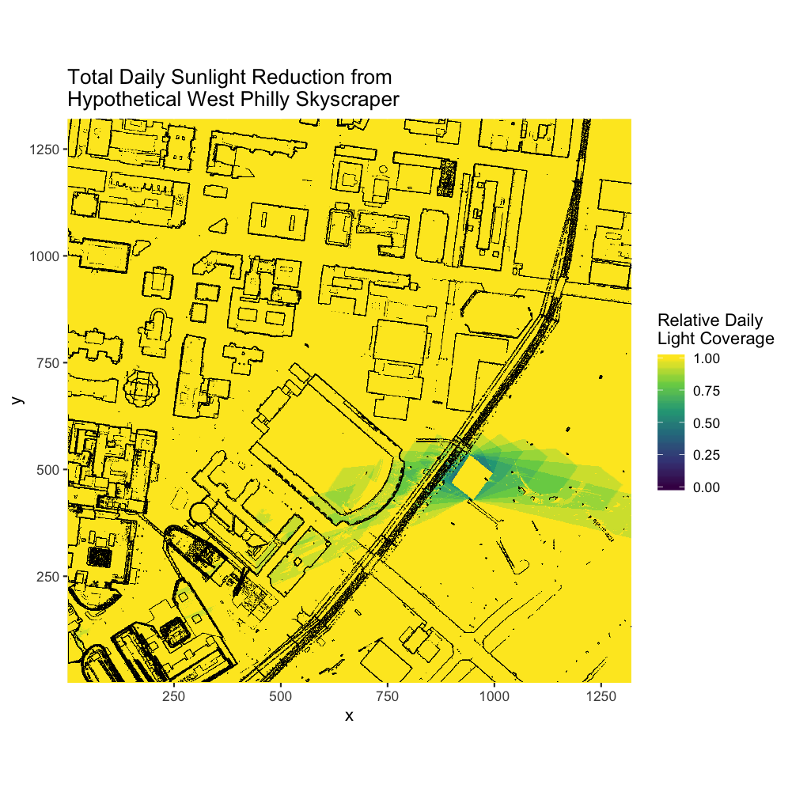

We can see this skyscraper doesn’t have much of an effect east of the
train tracks due to the stadium and number of buildings already there,
but it significantly reduces the amount of sunlight Penn Park recieves
during the afternoon. I think we’ll nix this skyscraper.

For fun, we can also plot a 3D visualization of a time slice from the
actual shadows from that day:

``` r
philly_with_building_mat_small %>%
  sphere_shade(colorintensity = 5, sunangle = 93) %>%
  add_shadow(philly_new_shadows[[3]],0.3) %>%
  add_water(detect_water(philly_with_building_mat_small,zscale = 4,
                         max_height= 10, cutoff = 0.93, min_area = 1000)) %>%
  plot_3d(philly_with_building_mat_small,zscale = 2,
          zoom = 0.5,phi = 30,fov = 70,
          windowsize = 1000, background = "#d9e7ff", shadowcolor = "#313947")
render_snapshot(title_text = "2019-06-21 8:30 AM, Philadelphia, Hypothetical Skyscraper",
                title_bar_color = "white",
                title_bar_alpha = 0.7,
                vignette = 0.2)
```


``` r
rgl::rgl.close()
```

I’m not going to run the following, but the code below will produce a 3D
rotating animation as the shadows move through the
day.

``` r
#download.file("https://dl.dropboxusercontent.com/s/gqnfs71t0u3pmu7/sunangles.Rds",
#               destfile = "sunangles.Rds")
## Alternate Link
# download.file("https://www.tylermw.com/data/sunangles.Rds",
#               destfile = "sunangles.Rds")
# 
# sunangles = readRDS("sunangles.Rds")
# str(sunangles)
# 
# transition_frames = round(seq(1,360,length.out = 14))[-14]
# transition_frames
# counter = 1
# for(i in 1:360) {
#   if(i %in% transition_frames) {
#     rgl::rgl.clear()
#     philly_with_building_mat_small %>%
#     sphere_shade(colorintensity = 5, sunangle = sunangles[[counter]]$azimuth+180) %>%
#     add_shadow(philly_new_shadows[[counter]],0.3) %>%
#     add_water(detect_water(philly_with_building_mat_small,zscale = 4,
#                            max_height= 10, cutoff = .93, min_area = 1000)) %>%
#     plot_3d(philly_with_building_mat_small,zscale = 2,
#             zoom = 0.5,phi = 30,fov = 70,
#             windowsize = 1000, background = "#d9e7ff", shadowcolor = "#313947")
#     counter = counter + 1
#   }
#   render_camera(theta = i)
#   render_snapshot(glue::glue("rotating{i}"))
# }
# 
# av::av_encode_video(glue::glue("rotating{1:60}.png"), output = "westphilly_movie.mp4", 
#                     framerate = 30)
```

For the sake of speed, this analysis was performed with hourly slices,
but you could improve the analysis by stepping down to a much smaller
timescale (e.g. `temptime = temptime + duration("180s")` for three
minute intervals). You could also remove the `reduce_matrix_size()` step
for increased resolution.

# That’s it\!

And that’s it for this overview of rayshader\! I hope this was enough to
get your started on your beautiful journey through the land of
cartography and 3D mapping. If you have any questions, ask me in real
life or on Twitter, and be sure to post any visualizations you make with
the \#MusaMasterclass, \#rayshader, and \#rstats hashtags. I’m always
impressed and enjoy seeing what people manage to create\!

Good luck, and happy shading\!
